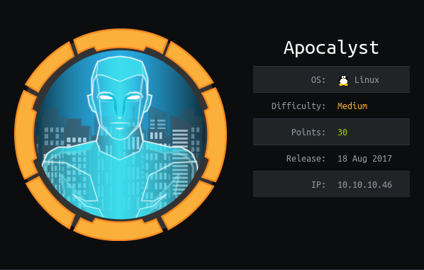

# USER

`nmap` scan shows a `http` endpoint. Links redirect to `apocalyst.htb`. Going to add to the `/etc/hosts` file

`http://10.10.10.46` server seems to have a weird endpoint where english words are redirected to a page with an image


We have a `/department` endpoint with a login. Looking at the source we can see a message:

```
<!-- @admin! MySQL is been installed.. please fix the login page! ~amrois -->
```

BULLSHIT: Only on the `/Rightiousness​` you can find an stego image. Not on the other endpoints

Running `steghide` on the weird image gives us a wordlist

Found a username using ``WPScan``

Using the word list we found ealier with the username we found the combination:

```
falaraki:Transclisiation
```
