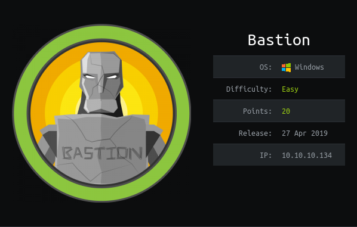

Scanning the box gives us a `smb` share with guest access.

Running:

```
smbclient.py guest@10.10.10.134
```

There is a `Backups` share that allows us access to a `.vhd` file.

I'm going to investigate with the tool `guestfs`. This allows me to mount the `.vhd` file locally and investigate.

This was okay to mount the small `.vhd` file, but downloading the ~5GB is an issue.

I'm going to use a Windows VM.