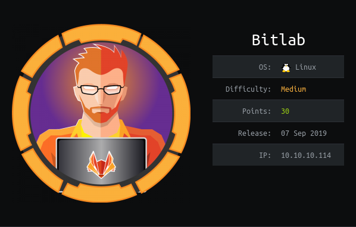

# USER

`http` endpoint shows us a GitLab host. `nmap` has shown us a very fully `robots.txt` file with lots of endpoints

Using this  we can enum the users present. We can see @root and @clave

On the `http://10.10.10.144/help` there is a weird url link:

```javascript
javascript:(function(){ var _0x4b18=[&quot;\x76\x61\x6C\x75\x65&quot;,&quot;\x75\x73\x65\x72\x5F\x6C\x6F\x67\x69\x6E&quot;,&quot;\x67\x65\x74\x45\x6C\x65\x6D\x65\x6E\x74\x42\x79\x49\x64&quot;,&quot;\x63\x6C\x61\x76\x65&quot;,&quot;\x75\x73\x65\x72\x5F\x70\x61\x73\x73\x77\x6F\x72\x64&quot;,&quot;\x31\x31\x64\x65\x73\x30\x30\x38\x31\x78&quot;];document[_0x4b18[2]](_0x4b18[1])[_0x4b18[0]]= _0x4b18[3];document[_0x4b18[2]](_0x4b18[4])[_0x4b18[0]]= _0x4b18[5]; })()
```

With a little formatting:

```javascript
javascript: (function () { 
    var _0x4b18 = [
        "\x76\x61\x6C\x75\x65",
        "\x75\x73\x65\x72\x5F\x6C\x6F\x67\x69\x6E",
        "\x67\x65\x74\x45\x6C\x65\x6D\x65\x6E\x74\x42\x79\x49\x64", 
        "\x63\x6C\x61\x76\x65 ",
        "\x75\x73\x65\x72\x5F\x70\x61\x73\x73\x77\x6F\x72\x64",
        "\x31\x31\x64\x65\x73\x30\x30\x38\x31\x78"]; 
        
        document[_0x4b18[2]](_0x4b18[1])[_0x4b18[0]] = _0x4b18[3]; document[_0x4b18[2]](_0x4b18[4])[_0x4b18[0]] = _0x4b18[5]; })()
```

We can convert the hex to strings. This will give us the password for `clave`

```
clave:11des0081x
```

Logging in we can see a couple of repos. Initially what is interesting is a "auto pull script" that runs `shell_exec`

What it does it pull from the `Profile` repo and place all files into the `/profile` directory.

This gives us an exploit, we can place a shell file in the Profile repo, merge and then direct ourselves to the url:

```
http://10.10.10.114/profile/<SHELL_NAME>.php
```

And execute our payload to get a low-priv shell. We now need to priv esc to user.

Running the enum script shows that a `postgresql` port is open. There is also a snippet of code with the username and password present:

```php
<?php
$db_connection = pg_connect("host=localhost dbname=profiles user=profiles password=profiles");
$result = pg_query($db_connection, "SELECT * FROM profiles");
```

As no `psql` binary is present, we have to use the php script to connect to the `db`.

After modifying the script like so:

```php
<?php 
    $db_connection = pg_connect("host=localhost dbname=profiles user=profiles password=profiles"); 
    $result = pg_query($db_connection, "SELECT * FROM profiles");

    while ($row = pg_fetch_row($result)) {
        echo $row[0]." - ".$row[1]." - ".$row[2]."\n";
    }
?>
```

We can run it to with `php -f <SCRIPT>` to print us the database rows

What is returned is so `base64` looking string.
```
1 - clave - c3NoLXN0cjBuZy1wQHNz==
```

It is not actually valid `base64` so trying it as the password for `clave` over `ssh` allows us to login!

We are now able to cat the `user.txt` and get the flag!

# ROOT

Present on the box it a `RemoteConnection.exe`.