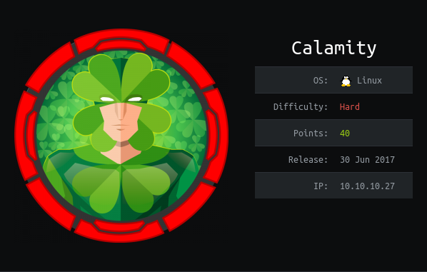

A new technique is using `-x` to specify file extensions on `gobuster`

This finds an `admin.php` page. Viewing the source and fully scrolling to the right gives us a password (WTF)

```
admin
skoupidotenekes
```

This gives us a website:

```html
<html>
<title>GOT U BEEJAY</title>
<body>
TADAA IT HAS NOTHING
<br>
what were you waiting for dude ?you know I aint finished creating<br>
xalvas,the boss said I am a piece of shit and that I dont take my job seriously...but when all this is set up...Ima ask for double the money<br>
just cauz he insulted me <br>
Maybe he's still angry at me deleting the DB on the previous site...he should keep backups man ! 
<br>
anyway I made an html interpreter to work on my php skills !

It wasn't easy I assure you...I'm just a P-R-O on PHP !!!!!!!!!
<br>
access in here is like 99% secure ,but even if that 1% reaches this page ,there's nothing they can do ! 
<br>
html is super-harmless to our system!
Try writing some simple stuff ...and see how difficult my job is and how underpaid I am


<form method="get">
Your HTML: <input type="text" name="html"><br>
  <input type="submit" value="SHOW ME DA PAGE">
</form> 
</body></html>
```

This has website parsing functionality. This can be used to put PHP code in and get RCE

However, it seems that any shells just die quickly

On further inspection of the `/home` there are a few interesting files:

```
alarmclocks
app
dontforget.txt
intrusions
peda
recov.wav
user.txt
```

intrusions contains

```
POSSIBLE INTRUSION BY BLACKLISTED PROCCESS nc         ...PROCESS KILLED AT 2017-06-28 04:55:42.796288
POSSIBLE INTRUSION BY BLACKLISTED PROCCESS nc         ...PROCESS KILLED AT 2017-06-28 05:22:11.228988
POSSIBLE INTRUSION BY BLACKLISTED PROCCESS nc         ...PROCESS KILLED AT 2017-06-28 05:23:23.424719
POSSIBLE INTRUSION BY BLACKLISTED PROCCESS nc         ...PROCESS KILLED AT 2017-06-29 02:43:57.083849
POSSIBLE INTRUSION BY BLACKLISTED PROCCESS python     ...PROCESS KILLED AT 2017-06-29 02:48:47.909739
POSSIBLE INTRUSION BY BLACKLISTED PROCCESS sh         ...PROCESS KILLED AT 2017-06-29 06:25:04.202315
POSSIBLE INTRUSION BY BLACKLISTED PROCCESS sh         ...PROCESS KILLED AT 2017-06-29 06:25:04.780685
POSSIBLE INTRUSION BY BLACKLISTED PROCCESS python     ...PROCESS KILLED AT 2017-06-29 06:25:06.209358
POSSIBLE INTRUSION BY BLACKLISTED PROCCESS nc        ...PROCESS KILLED AT 2017-06-29 12:15:32.329358
POSSIBLE INTRUSION BY BLACKLISTED PROCCESS nc        ...PROCESS KILLED AT 2017-06-29 12:15:32.330115
POSSIBLE INTRUSION BY BLACKLISTED PROCCESS nc        ...PROCESS KILLED AT 2017-06-29 12:16:10.508710
POSSIBLE INTRUSION BY BLACKLISTED PROCCESS nc        ...PROCESS KILLED AT 2017-06-29 12:16:10.510537
POSSIBLE INTRUSION BY BLACKLISTED PROCCESS python3    ...PROCESS KILLED AT 2017-12-24 10:30:28.836132
POSSIBLE INTRUSION BY BLACKLISTED PROCCESS nc        ...PROCESS KILLED AT 2019-05-08 23:22:22.106025
POSSIBLE INTRUSION BY BLACKLISTED PROCCESS nc        ...PROCESS KILLED AT 2019-05-08 23:26:31.539314
POSSIBLE INTRUSION BY BLACKLISTED PROCCESS nc        ...PROCESS KILLED AT 2019-05-08 23:38:43.769768
POSSIBLE INTRUSION BY BLACKLISTED PROCCESS nc        ...PROCESS KILLED AT 2019-05-08 23:38:57.863530
POSSIBLE INTRUSION BY BLACKLISTED PROCCESS python3    ...PROCESS KILLED AT 2019-05-09 22:34:36.090427
POSSIBLE INTRUSION BY BLACKLISTED PROCCESS bash       ...PROCESS KILLED AT 2019-05-11 14:49:52.512404
POSSIBLE INTRUSION BY BLACKLISTED PROCCESS bash       ...PROCESS KILLED AT 2019-05-11 14:50:00.567671
POSSIBLE INTRUSION BY BLACKLISTED PROCCESS bash       ...PROCESS KILLED AT 2019-05-11 14:50:22.701986
POSSIBLE INTRUSION BY BLACKLISTED PROCCESS bash       ...PROCESS KILLED AT 2019-05-11 14:50:30.748052
POSSIBLE INTRUSION BY BLACKLISTED PROCCESS bash       ...PROCESS KILLED AT 2019-05-11 14:50:40.811368
POSSIBLE INTRUSION BY BLACKLISTED PROCCESS bash       ...PROCESS KILLED AT 2019-05-11 14:50:46.841152
```

This is the reason why the nc session was being terminated quickly