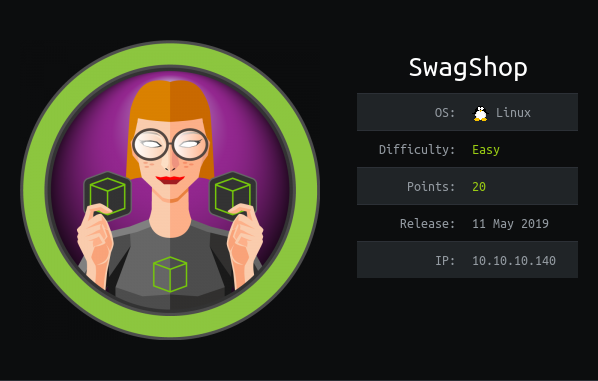

# USER

We endpoint is a shopping web application called Magento.

Looking through http://10.10.10.140/app/etc/local.xml

We have found possible creds for a database?

```xml
<host>
    localhost
</host>
<username>
    root
</username>
<password>
    fMVWh7bDHpgZkyfqQXreTjU9
</password>
<dbname>
    swagshop
</dbname>
<model>
    mysql4
</model>
```

Script called `exploit.py` runs a SQL Injection attack that creates us a admin user

```
ypwq
123
```

We can now login to the admin console

Reading this blog post shows we can get a RCE.
https://blog.scrt.ch/2019/01/24/magento-rce-local-file-read-with-low-privilege-admin-rights/

We add a custom option of "File" that allows us to upload the file to the application. The location of the file is in `media/custom_options`

This lets us upload a `php` shell

We can now obtain the `user.txt`!

# ROOT
After upgrading the shell and running LinEnum.sh it is clear that the user `www-data` has a sudo NOPASS active

```
www-data ALL=NOPASSWD:/usr/bin/vi /var/www/html/*
```

Therefore, running:

```
sudo vi /var/www/html* 
```

And then in the vim prompt running:

```
!/bin/sh
```

Gives us a root shell!