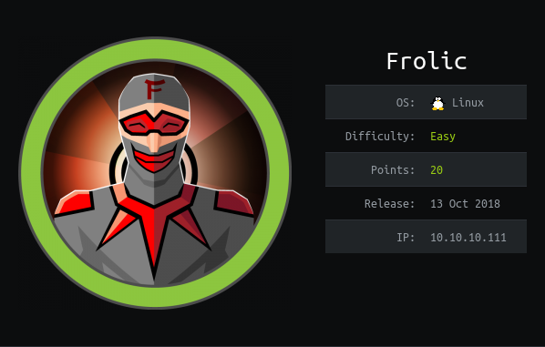

# USER

Gobuster

```
http://10.10.10.111:9999
    /admin 
        /css
        /js  
    /test
    /dev
        /test
        /backup
    /backup 3
    /loop
    /playsms
        /storage
        /lib
        /inc
        /plugin
    
http://10.10.10.111:1880
    /red (Status: 301)
    /vendor (Status: 301)
```

Url: http://10.10.10.111:9999/backup/ shows:

```
password.txt user.txt loop/
```

Retrieving ```password.txt``` gives:
```
user - admin
password - imnothuman
```

Checking the source code on http://10.10.10.111:9999/admin/ gives the admin password

```
admin
superduperlooperpassword_lol
```

This page gives us:

```
..... ..... ..... .!?!! .?... ..... ..... ...?. ?!.?. ..... ..... ..... ..... ..... ..!.? ..... 
..... .!?!! .?... ..... ..?.? !.?.. ..... ..... ....! ..... ..... .!.?. ..... .!?!! .?!!! !!!?. 
?!.?! !!!!! !...! ..... ..... .!.!! !!!!! !!!!! !!!.? ..... ..... ..... ..!?! !.?!! !!!!! !!!!! 
!!!!? .?!.? !!!!! !!!!! !!!!! .?... ..... ..... ....! ?!!.? ..... ..... ..... .?.?! .?... ..... 
..... ...!. !!!!! !!.?. ..... .!?!! .?... ...?. ?!.?. ..... ..!.? ..... ..!?! !.?!! !!!!? .?!.? 
!!!!! !!!!. ?.... ..... ..... ...!? !!.?! !!!!! !!!!! !!!!! ?.?!. ?!!!! !!!!! !!.?. ..... ..... 
..... .!?!! .?... ..... ..... ...?. ?!.?. ..... !.... ..... ..!.! !!!!! !.!!! !!... ..... ..... 
....! .?... ..... ..... ....! ?!!.? !!!!! !!!!! !!!!! !?.?! .?!!! !!!!! !!!!! !!!!! !!!!! .?... 
....! ?!!.? ..... .?.?! .?... ..... ....! .?... ..... ..... ..!?! !.?.. ..... ..... ..?.? !.?.. 
!.?.. ..... ..!?! !.?.. ..... .?.?! .?... .!.?. ..... .!?!! .?!!! !!!?. ?!.?! !!!!! !!!!! !!... 
..... ...!. ?.... ..... !?!!. ?!!!! !!!!? .?!.? !!!!! !!!!! !!!.? ..... ..!?! !.?!! !!!!? .?!.? 
!!!.! !!!!! !!!!! !!!!! !.... ..... ..... ..... !.!.? ..... ..... .!?!! .?!!! !!!!! !!?.? !.?!! 
!.?.. ..... ....! ?!!.? ..... ..... ?.?!. ?.... ..... ..... ..!.. ..... ..... .!.?. ..... ...!? 
!!.?! !!!!! !!?.? !.?!! !!!.? ..... ..!?! !.?!! !!!!? .?!.? !!!!! !!.?. ..... ...!? !!.?. ..... 
..?.? !.?.. !.!!! !!!!! !!!!! !!!!! !.?.. ..... ..!?! !.?.. ..... .?.?! .?... .!.?. ..... ..... 
..... .!?!! .?!!! !!!!! !!!!! !!!?. ?!.?! !!!!! !!!!! !!.!! !!!!! ..... ..!.! !!!!! !.?. 
```

This can be converted into Ook! That then can be converted into brainfuck
That when run gives us:

```
Nothing here check /asdiSIAJJ0QWE9JAS 
```


http://10.10.10.111:9999/asdiSIAJJ0QWE9JAS gives us:

```
UEsDBBQACQAIAMOJN00j/lsUsAAAAGkCAAAJABwAaW5kZXgucGhwVVQJAAOFfKdbhXynW3V4CwAB BAAAAAAEAAAAAF5E5hBKn3OyaIopmhuVUPBuC6m/U3PkAkp3GhHcjuWgNOL22Y9r7nrQEopVyJbs K1i6f+BQyOES4baHpOrQu+J4XxPATolb/Y2EU6rqOPKD8uIPkUoyU8cqgwNE0I19kzhkVA5RAmve EMrX4+T7al+fi/kY6ZTAJ3h/Y5DCFt2PdL6yNzVRrAuaigMOlRBrAyw0tdliKb40RrXpBgn/uoTj lurp78cmcTJviFfUnOM5UEsHCCP+WxSwAAAAaQIAAFBLAQIeAxQACQAIAMOJN00j/lsUsAAAAGkC AAAJABgAAAAAAAEAAACkgQAAAABpbmRleC5waHBVVAUAA4V8p1t1eAsAAQQAAAAABAAAAABQSwUG AAAAAAEAAQBPAAAAAwEAAAAA 
```

This can be converted into a zip file with the password: "password"

This provides a .php file with just hex in it
Hex --> Base64 decodes gives:

```
+++++ +++++ [->++ +++++ +++<] >++++ +.--- --.++ +++++ .<+++ [->++ +<]>+
++.<+ ++[-> ---<] >---- --.-- ----- .<+++ +[->+ +++<] >+++. <+++[ ->---
<]>-- .<+++ [->++ +<]>+ .---. <+++[ ->--- <]>-- ----. <++++ [->++ ++<]>
++..< 
```

Running the program gives us:

```
idkwhatispass
```

NEW TOOL - Enumueration for SMB
```
enum4linux <target>
```

Possible linux users
```
sahay
ayush
```

Login page at http://10.10.10.111:9999/playsms

playsms has a file upload vulnerability
The vulnerability works by exploiting how the csv file executes php code
It exploits the http-agent as RCE

Metasploit
```
multi/http/playsms_uploadcsv_exec
```

This gives us a reverse shell

# ROOT

Found an interesting file running as a root SUID
```
-rwsr-xr-x 1 root root 7480 Sep 25 00:59 /home/ayush/.binary/rop
```

The binary is exploitable through a process called: return to libc

Running the command below will display the state of stack randomization
```
sysctl kernel.randomize_va_space
```

Stack randomization isn't active

libc address
```
$ ldd rop

libc.so.6 => /lib/i386-linux-gnu/libc.so.6 (0xb7e19000)
```

Buffer is 48 long

```readelf``` Allows us to search for system address

```
$ readelf -s /lib/i386-linux-gnu/libc.so.6 | grep system
$ strings -a -t x /lib/i386-linux-gnu/libc.so.6
```

Running our exploit.py gives us a root shell!

NOTE: Watching ippsec 'October' video will assist with any issues