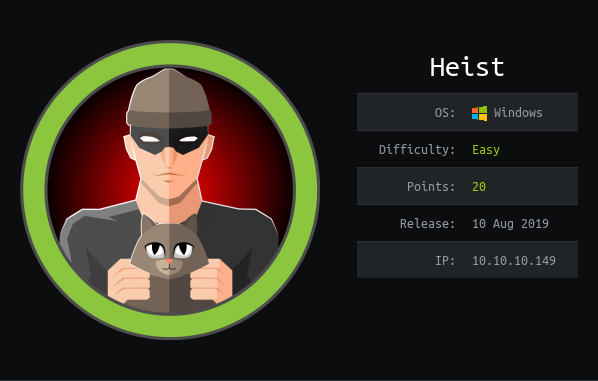

# USER

The box has exposed a `http` endpoint with a login page. On further inspection the page allows us to log on as a guest.

We are then redirected to a page with a support chat. On it is a link to a Cisco IOS config file. Via some searching it is found that the passwords present can be easily decrypted using this [page](http://www.ifm.net.nz/cookbooks/passwordcracker.html)

Meaning these:
```
[..]
username rout3r password 7 0242114B0E143F015F5D1E161713
username admin privilege 15 password 7 02375012182C1A1D751618034F36415408
[..]
```

Can be converted into these:
```
rout3r:$uperP@ssword
admin:Q4)sJu\Y8qz*A3?d
```

This is due to a trivially reverseable algorithm being used to 'encrypt' the passwords