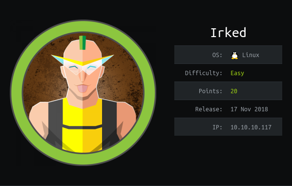

# USER

Was able to exploit the machine using a Metasploit module for UnrealIRCd

# ROOT

Found this password in a .backup file??
```
Super elite steg backup pw

UPupDOWNdownLRlrBAbaSSss
```

SUID and SGID are files that required elivated privileges to run

Found viewuser with the sticky bit set
```
-rwsr-xr-x 1 root root 7328 May 16  2018 /usr/bin/viewuser
```

```viewuser``` executes a file called ```listusers``` found in the tmp directory
by replacing that with a reverse shell you can gain a root shell