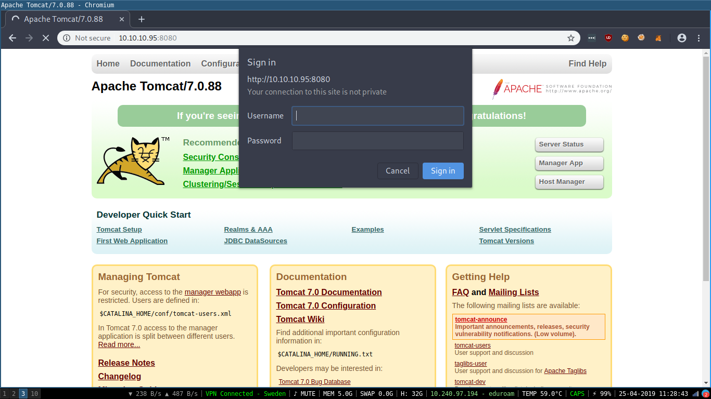

# USER & ROOT

The only port open in our nmap scan is the `8080` http port. 

Going onto it there is a Apache Tomcat instance.

On the /manager endpoint we're presented with a HTTP basic auth prompt



This means we can use hydra to attempt a brute force of the credentials. SecLists has a file called `tomcat-betterdefaultpasslist.txt` that we can use for this purpose.

We want to use the `-C` option because of our comma separated username:password format.

Running it gives us:
```
hydra -C tomcat_defaults.txt http-get://10.10.10.95:8080/manager/http
```

```
[8080][http-get] host: 10.10.10.95   login: admin   password: admin
[8080][http-get] host: 10.10.10.95   login: tomcat   password: s3cret
```

The user:pass `admin:admin` is a false positive. The default user:pass in the documentation is `tomcat:s3cret` and this box has left it as default. 

Using the tool at https://github.com/mgeeky/tomcatWarDeployer we're able to get a shell and grab both flags!