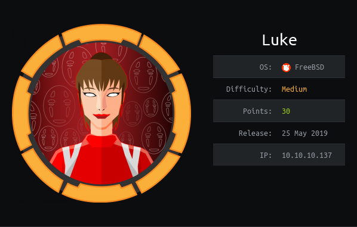

Running `nmap` we find an `ftp` endpoint with anon bind

With a message:

```
Dear Chihiro !!

As you told me that you wanted to learn Web Development and Frontend, I can give you a little push by showing the sources of 
the actual website I've created .
Normally you should know where to look but hurry up because I will delete them soon because of our security policies ! 

Derry
```

We have two other `http` endpoints:

    - 3000: Returns JSON with a failed auth message
    - 8000: Ajenti console

We also have a port on 22 that just hangs?

`Config.php` endpoint is available with credentials:

```
root
Zk6heYCyv6ZE9Xcg
```

Working with JWT we have a `/login` endpoint

Where data can be sent like:
```
curl --header "Content-Type: application/json" --request POST --data '{"password":"password", "username":"admin"}' http://10.10.10.137:3000/login
```

https://medium.com/dev-bits/a-guide-for-adding-jwt-token-based-authentication-to-your-single-page-nodejs-applications-c403f7cf04f4

I attempted a 'none' attack on JWT

TODO: Try brute forcing the `/login` endpoint for the JWT