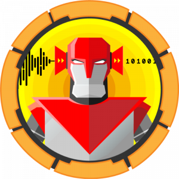
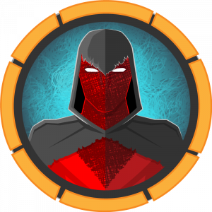
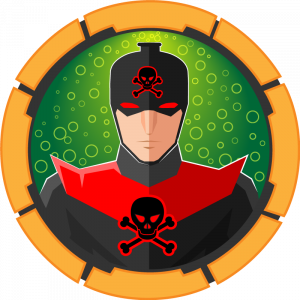

# Medium Boxes

<!--  -->
<!--  -->
<!--  -->
<!--  -->

|                                                               |   Name            |      OS                                |           Walkthrough              |
|-------------------------------------------------------------- | ----------------- |----------------------------------------|:----------------------------------:|
|           |  AI               |   | **X** <!-- [View](AI/README.md) -->       |
|    |  Apocalyst        |   | [View](Apocalyst/README.md)        |
|       |  Bitlab           |   | [View](Bitlab/README.md)           |
|      |  Carrier          |   | [View](Carrier/README.md)          |
|        |  Chaos            |   | [View](Chaos/README.md)            |
|        |  Craft            |   | [View](Craft/README.md)            |
|      |  Dev0ops          |   | [View](Dev0ops/README.md)          |
|       |  Jarvis           |   | [View](Jarvis/README.md)           |
|         |  Json             |   | [View](Json/README.md)             |
|  |  Lightweight      |   | [View](Lightweight/README.md)      |
|         |  Luke             |   | [View](Luke/README.md)             |
|      |  October          |   | [View](October/README.md)          |
|       |  Poison           |   | [View](Poison/README.md)           |
|      |  Popcorn          |   | [View](Popcorn/README.md)          |
|      |  Querier          |   | [View](Querier/README.md)          |
|     |  Resolute         |   | **X** <!-- [View](Resolute/README.md) -->         |
|      |  Teacher          |   | [View](Teacher/README.md)          |
|         |  Wall             |   | [View](Wall/README.md)             |
|       |  Ypuffy           |  | [View](Ypuffy/README.md)           |
