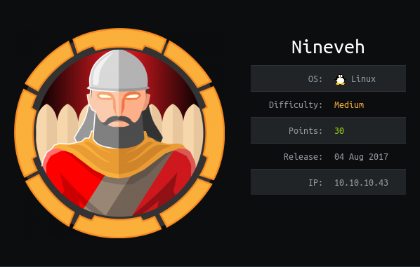

# USER

Two ports open `http` and `https`. `https` cert has mention on `nineveh.htb`. Going to add to the `/etc/hosts` file.

Enumerate on the `https` endpoint provides an image with a `private` and `public` ssh key in them. This is for the user: `amoris`

The keys were obtained by running:

```
binwalk -e <IMAGE>.png
```

And the endpoint was `secure_notes`