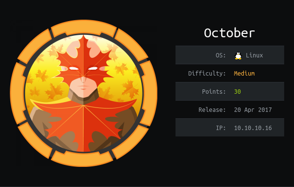

# USER

Web based port open, however it seems to be throttling gobuster.

Looking at command vulns I can find a `/backend` path. This gives us a login

Trying the classic `admin:admin` gives us a login

With so research on `exploit-db` I found:

```
1. PHP upload protection bypass
-------------------------------

Authenticated user with permission to upload and manage media contents can
upload various files on the server. Application prevents the user from
uploading PHP code by checking the file extension. It uses black-list based
approach, as seen in octobercms/vendor/october/rain/src/Filesystem/
Definitions.php:blockedExtensions().

==================== source start ========================
106 <?php
107 protected function blockedExtensions()
108 {
109         return [
110                 // redacted
111                 'php',
112                 'php3',
113                 'php4',
114                 'phtml',
115                 // redacted
116         ];
117 }
====================  source end  ========================

We can easily bypass file upload restriction on those systems by using an
alternative extension, e.g if we upload sh.php5 on the server:
```

Uploading a shell with `.php5` gives us upload ability

Clicking the `public url` link runs our shell. This provides us with a shell!

Navigating to `/home/harry` gives us the `user.txt`