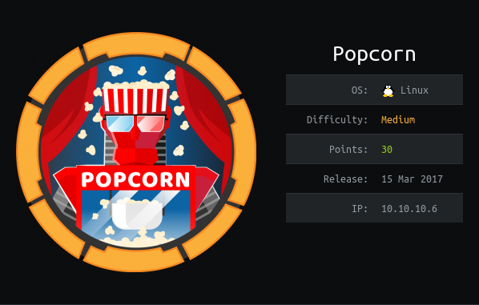

# USER

Using nmap to scan the box we get `ssh` and `http`. 

Scanning `http` with gobuster gives a few endpoints.

One interesting endpoint is the `\rename`

Running:
```
http://10.10.10.6/rename/index.php?filename=index.php&newfilename=test
```

Gives us the code of the page:

```php
<?php
if (isset($_GET['filename']) && isset($_GET['newfilename']))
{
	if(rename($_GET['filename'],$_GET['newfilename'])) echo 'OK!';
} else echo 'Renamer API Syntax: index.php?filename=old_file_path_an_name&newfilename=new_file_path_and_name';
?>
```

This isn't much help but gives the full picture of what's happening


Further investigating the `/torrent` endpoint gives us a `/database` endpoint. This proves us with an exposed `.sql` file. At the end of the file is a sql command adding the admin to the database:

```
INSERT INTO `users` VALUES (3, 'Admin', '1844156d4166d94387f1a4ad031ca5fa', 'admin', 'admin@yourdomain.com', '2007-01-06 21:12:46', '2007-01-06 21:12:46');
```

This md5 hash proves us with the password:

```
admin12
```

This, however doesn't seem to work as a valid login?

The website does allow register functionality, so registering a user allows us access to the upload functionality.

Uploading any file gives us:

```
This is not a valid torrent file
```

However, getting a dud `.torrent` file allows us to upload. After uploading we're allowed to edit the thumbnail of the torrent. This gives us a chance to upload a `.png` file. 

It will only allow `.php` to be uploaded via in the interface. It will fail initally but the server only checks the content type, changing this to `image/png` will allow the upload of any file. 

This allows us to upload a file to the server. The resulting file can be found in `torrent/upload`

This gives us a reverse shell and allows us to view the `user.txt`

The exploit above has been incorporated into a script called `automated_shell.py`. This will spawn a netcat session automatically. 

# ROOT

Looking in george's home we have a uncommon file `.cache/motd.legal-displayed`

With a bit of research it looks like this is a sign of a vulnerability defined in CVE-2010-0832.

From the research

```
...
Exploitation of this PAM MOTD module vulnerability results in the user gaining read and access rights to /etc/shadow
...
```

This would allow us to overwrite root