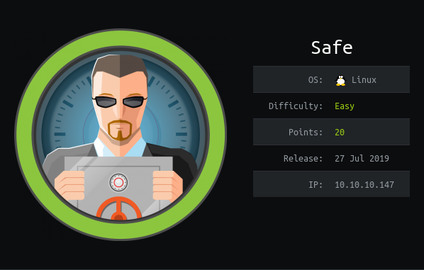

# USER

Looking at the page source we can seen the message

```html
<!-- 'myapp' can be downloaded to analyze from here
     its running on port 1337 -->
```

Address for `libc`
```
$ ldd myapp

libc.so.6 => /usr/lib/libc.so.6 (0x00007f46cde8f000)
```

Searching for the system address

```
$ objdump -d myapp | grep system@plt

  40116e:       e8 cd fe ff ff          callq  401040 <system@plt>
```


readelf Allows us to search for system address

```
$ readelf -s /lib/i386-linux-gnu/libc.so.6 | grep system
$ strings -a -t x /lib/i386-linux-gnu/libc.so.6
```