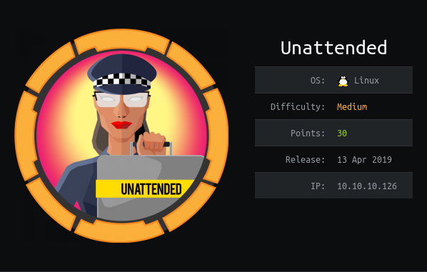

# USER

Nmap shows two endpoints (http/https) that lead to weird sites that just contain a fullstop.

Https endpoint has `commonName` as:

```
www.nestedflanders.htb
```

This could lead to a hidden page via virtual host routing. Adding this url to the /etc/hosts gives us a default apache page.

`/dev` found via gobuster. Page gives:

```
dev site has been moved to his own server 
```